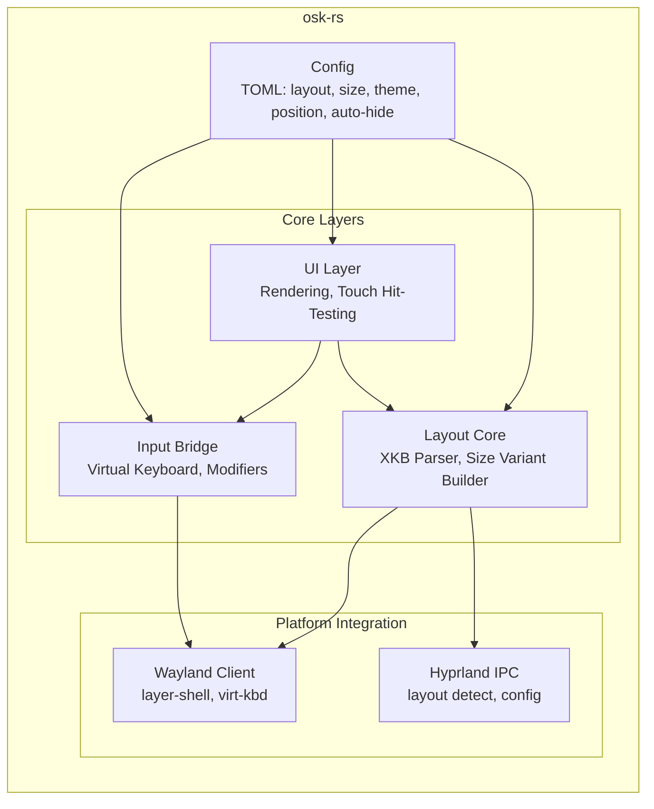
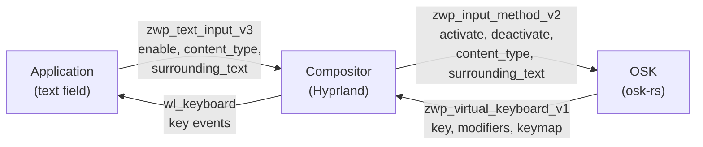
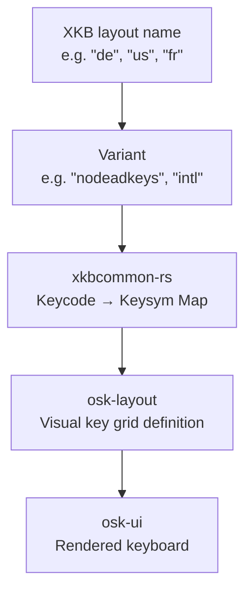
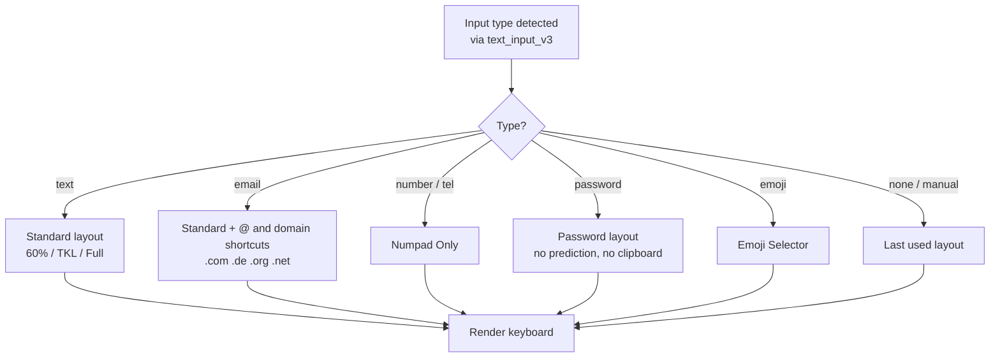
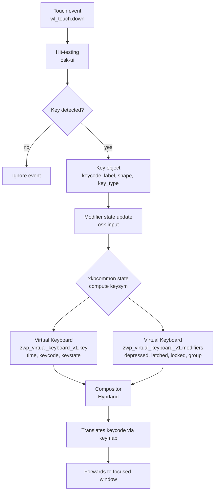
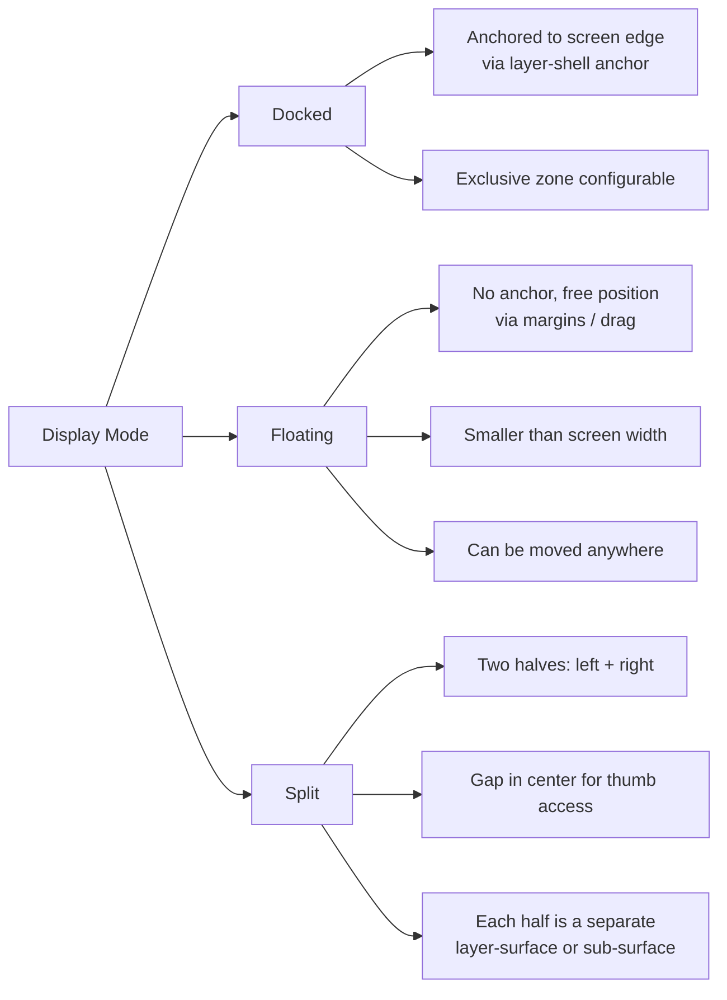
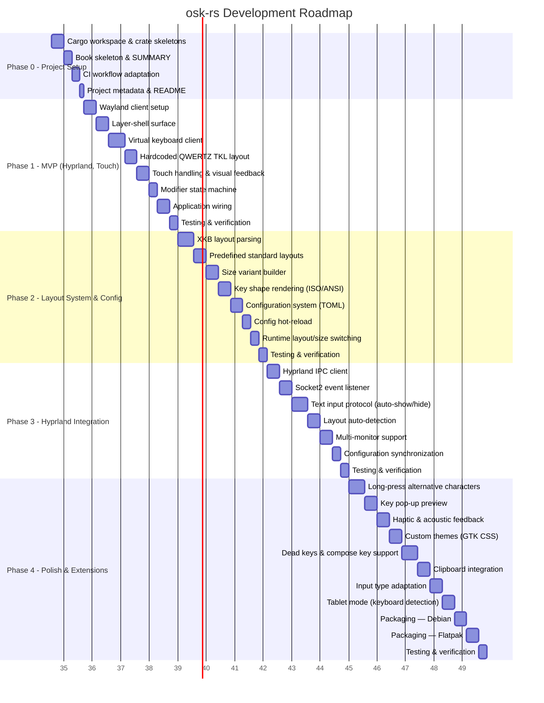

# Concept Draft: osk-rs — On-Screen Keyboard in Rust

Status: Draft (planned)
Date: 2026-08-27

## 1. Objective

`osk-rs` is an On-Screen Keyboard (OSK) written in Rust, primarily designed for **Hyprland** (Wayland) and optimized for **touchscreen operation** on machines **without a physical keyboard**. It supports multiple keyboard layouts (QWERTZ, QWERTY, AZERTY, …), various size variants (60% / TKL / Full-Size), and reads the currently active layout via Hyprland IPC.

### Motivation

There is currently no on-screen keyboard that fulfills all of the following requirements simultaneously:

- **Designed for touchscreens** — large touch targets, multi-touch, visual feedback, long-press alternatives, key pop-up previews
- **Works with Hyprland** — integrates via Hyprland IPC for layout detection, Socket2 events, and multi-monitor support
- **Movable** — the keyboard layer can be repositioned via two-finger longpress drag to adapt to the usage context (e.g. placing it above the focused text field)
- **Supports multiple keyboard layouts** — QWERTZ, QWERTY, AZERTY, Dvorak, … via XKB, with automatic layout detection from the active desktop environment
- **Provides different keyboard sizes** — 60% (Compact), TKL (Tenkeyless), Full-Size — to adapt to different screen sizes and use cases
- **Handles function keys correctly** — F1–F12, Esc, Enter, Tab, Backspace, Delete, arrow keys, modifiers (Shift/Ctrl/Alt/Super), compose keys, dead keys
- **Renders key shapes correctly** — ISO L-shaped Enter (de, fr, uk) vs. ANSI wide Enter (us), wide Tab, wide Shift, spacebar, numpad keys — based on the active XKB layout
- **Configurable and controllable** — TOML configuration file with hot-reload, CLI overrides, runtime layout/size switching, theme support, auto-show/auto-hide via `text_input_v3`

Existing solutions fall short in various ways: `wtype` is a command-line tool without a UI. `squeekboard` lacks layout detection and configurable sizes. `wvkbd` has limited layout support and no drag/rotation features. None of these combine touchscreen-first design, Hyprland integration, layout/size flexibility, correct key shape rendering, and full configurability in a single solution.

`osk-rs` fills this gap.

### Compositor Compatibility

`osk-rs` requires a Wayland compositor that implements the following protocols:

| Protocol | Required for | Fallback |
|---|---|---|
| `zwlr_layer_shell_v1` | Overlay surface rendering | None — hard requirement |
| `zwp_virtual_keyboard_manager_v1` | Key event injection | None — hard requirement |
| `zwp_input_method_v2` | Focus tracking, content_type hints, auto-show/hide | Manual toggle via IPC/CLI |
| `wp_fractional_scale_v1` | HiDPI scaling | Integer scaling fallback |

**Supported compositors:**

| Compositor | Status | Notes |
|---|---|---|
| **Hyprland** | ✅ Primary target | Full support — IPC integration for layout detection, Socket2 events, multi-monitor |
| **Sway** | ✅ Supported | wlroots-based, all required protocols available; no Hyprland IPC (layout detection via fallback) |
| **River** | ✅ Supported | wlroots-based, all required protocols available; layout detection via fallback |
| **Wayfire** | ✅ Supported | wlroots-based, all required protocols available; layout detection via fallback |

`zwlr_layer_shell_v1` and `zwp_virtual_keyboard_manager_v1` are the primary prerequisites. Any wlroots-based compositor implementing these protocols can run `osk-rs`. Hyprland-specific features (layout detection via IPC, Socket2 event monitoring) degrade gracefully — the OSK falls back to manual layout selection and standard Wayland protocols.

## 2. Requirements

### 2.1 Functional

- **F1** Send key events to Wayland clients (Virtual Keyboard Protocol)
- **F2** Render as a Wayland Layer-Shell surface (overlay above all windows)
- **F3** Touch operation as the primary input method (large keys, multi-touch)
- **F4** Multiple keyboard layouts: QWERTZ, QWERTY, AZERTY, Dvorak, … (XKB-based)
- **F5** Size variants: 60%, Tenkeyless (TKL / 80%), Full-Size (100%)
- **F6** Detect active layout via Hyprland IPC (`hyprctl` / socket)
- **F7** Layout and size switching at runtime (without restart)
- **F8** Function keys, modifiers (Shift/Ctrl/Alt/Super), special keys (Esc, Enter, Backspace, Tab, arrow keys)
- **F9** Auto-show / auto-hide: keyboard appears when a text field is focused (text-input-v3)
- **F10** Configuration via TOML file (layout, size, theme, position, auto-hide)
- **F11** OSK layer movable via touch (two-finger longpress initiates drag mode)
- **F12** OSK layer rotatable via `smearor-wrot-rotation`
- **F13** Special layouts: numpad-only, special keys, math keys, emoji selector, password layout
- **F14** Automatic adaptation to input type (e.g. `@` and domain shortcuts for email fields, numpad-only for phone numbers)
- **F15** Automatic adaptation to system color scheme (dark / light mode)
- **F16** Configurable visual and acoustic feedback on key press
- **F17** Configurable debounce (response delay) for touch input
- **F18** Configurable enlarged hitboxes (touch target sizes)
- **F19** Automatic show/hide on text field focus and on physical keyboard disconnect (tablet mode)
- **F20** System clipboard integration with clipboard history
- **F21** Flexible display modes: docked to screen edge, floating window, split keyboard (thumb typing on tablets)
- **F22** D-Bus session bus IPC: methods (Show, Hide, Toggle, SetLayout, SetScale, …) and signals (VisibilityChanged, LayoutChanged)
- **F23** Unix domain socket IPC: local socket server for CLI control commands
- **F24** POSIX signal handling: SIGUSR1 toggles visibility, SIGHUP reloads config

### 2.2 Non-functional

- **NF1** Startup time < 200 ms (cold)
- **NF2** Latency touch → key event < 50 ms
- **NF3** Low resource usage (< 30 MB RSS when idle)
- **NF4** GTK 4 as the UI framework (built-in touch handling, theme system, accessibility)

## 3. Architecture Overview



### Modules / Crates

| Crate / Module | Responsibility |
|---|---|
| `osk-core` | Shared types: Key, KeyState, LayoutDef, SizeVariant |
| `osk-layout` | XKB layout parsing, size variant builder, key map generation |
| `osk-input` | Virtual keyboard protocol client, modifier state machine, key event sequencing |
| `osk-wayland` | Wayland client: layer-shell surface, registry bind, seat handling |
| `osk-hyprland` | Hyprland IPC client: layout detection, config read, workspace events |
| `osk-detect` | `LayoutDetector` trait + auto-detection: selects backend at runtime |
| `osk-ui` | Rendering + touch hit-testing (renderer-dependent, see §4) |
| `osk-config` | TOML configuration, hot-reload, CLI args |
| `osk-ipc` | D-Bus session bus service, Unix domain socket server, POSIX signal handling |
| `osk-app` | Binary: connects all modules, event loop |

## 4. Technology Stack (Recommendation)

### 4.1 Wayland Client

**Decision: Standalone Wayland client (not a Hyprland plugin)**

- Runs as a standalone Wayland client → maximally portable across compositors
- Uses `zwlr_layer_shell_v1` for the overlay surface
- Uses `zwp_virtual_keyboard_manager_v1` for key injection
- No dependency on `hyprland-plugin-support` → works on Sway and other wlroots-based compositors

### 4.2 Rendering

**Decision: GTK 4 + `gtk4-layer-shell`**

- GTK 4 provides built-in touch handling (`GtkGesture*`), a theme system (CSS), and accessibility
- `gtk4-layer-shell` binds `zwlr_layer_shell_v1` to GTK 4 (for wlroots/Hyprland)
- Rust bindings: `gtk4` (gtk-rs) + `gtk4-layer-shell` (gtk-rs-layer-shell)
- Rendering via GTK's native renderer (OpenGL/Vulkan/Cairo backend)

**Advantages over iced / tiny_skia:**
- No custom hit-testing needed — GTK handles touch event routing to widgets
- CSS theming available out of the box — keyboard keys as GTK widgets with CSS classes
- Accessibility (AT-SPI) built in
- Drag & rotation easily implementable as GTK gestures

**Disadvantages:**
- GTK runtime dependency (~40 MB) — accepted for the rich feature set
- Higher startup overhead than a pure Rust solution — due to GTK initialization

**Boundary:** `smithay-client-toolkit` is not used. Wayland protocol bindings not exposed by GTK 4 (Virtual Keyboard, Text Input, Input Method) are accessed by reusing GTK's native `wl_display` via `gdk4-wayland` FFI on the same connection (see §7.7).

### 4.3 XKB Layout Parsing

**`xkbcommon-rs`** (bindings to `libxkbcommon`)

- Reads XKB layout definitions (`/usr/share/X11/xkb/symbols/`)
- Provides keycode → keysym mapping per layout
- Supports layout variants (e.g. `de` → `de(nodeadkeys)`)
- State object for modifier tracking (Shift, AltGr, CapsLock)

### 4.4 Hyprland IPC

**`hyprland-rs`** (community crate) or direct socket communication

- `hyprctl devices` → list of keyboards with layout
- `hyprctl getoption input:kb_layout` → global layout
- Event stream (`hyprland IPC .socket2`) for layout change notifications
- A custom IPC client (`osk-hyprland`) avoids third-party crate dependency

### 4.5 Configuration

**`serde` + `toml`**

- TOML file: `~/.config/osk-rs/config.toml`
- Hot-reload via `notify` crate (file watcher)
- CLI overrides via `clap`

## 5. Wayland Protocols

| Protocol | Purpose | Status in Hyprland |
|---|---|---|
| `zwlr_layer_shell_v1` | Overlay surface (keyboard appears above all windows) | ✅ supported |
| `zwp_virtual_keyboard_manager_v1` | Send key events to the compositor | ✅ supported |
| `zwp_text_input_v3` | Application → compositor: focus notification, content_type hints (text field active → show keyboard) | ✅ supported |
| `zwp_input_method_v2` | Compositor → OSK: receives focus state, content_type, and surrounding text from the compositor as the receiving counterpart to `zwp_text_input_v3` | ✅ supported |
| `zwp_input_method_manager_v2` | Manager protocol to create `zwp_input_method_v2` instances | ✅ supported |
| `wl_touch` / `wl_pointer` | Receive touch/pointer events | ✅ core protocol |
| `wp_fractional_scale_v1` | HiDPI scaling | ✅ supported |
| `wl_seat` | Seat management (multi-seat support) | ✅ core protocol |

**Text input flow — `zwp_text_input_v3` vs. `zwp_input_method_v2`:**

The application communicates with the compositor via `zwp_text_input_v3` (focus, content_type, surrounding text). The compositor then forwards this information to the OSK via `zwp_input_method_v2`. The OSK binds `zwp_input_method_manager_v2` from the registry and creates an input method instance to receive these relayed events:



The OSK listens for `zwp_input_method_v2` events (`activate`, `deactivate`, `surrounding_text`, `text_change_cause`, `content_type`) to drive auto-show/auto-hide and input type adaptation (see §6.6).

### Layer-Shell Configuration

- **Layer**: `Overlay` (above everything, including panels)
- **Anchor**: `Bottom | Left | Right` (keyboard at the bottom of the screen)
- **Keyboard interactivity**: `Exclusive` (keyboard input is processed by the OSK)
- **Exclusive zone**: 0 (overlay, no reserved screen space) or configurable

## 6. Layout System

### 6.1 XKB Layouts (QWERTZ, QWERTY, …)



- Layout definitions are loaded from `xkbcommon`
- Visual arrangement (which key is where in the grid) is defined in `osk-layout`
- Predefined standard layouts: `de` (QWERTZ), `us` (QWERTY), `fr` (AZERTY), `dvorak`
- Custom layouts possible via TOML override

### 6.2 Size Variants

| Variant | Designation | Contents |
|---|---|---|
| **60%** | Compact | Main block (alpha + modifiers + space), no F-keys, no nav cluster, no numpad |
| **80%** | TKL (Tenkeyless) | Main block + F-key row + nav cluster (Insert, Del, Home, End, PgUp, PgDn, arrow keys) |
| **100%** | Full-Size | TKL + numpad |

### 6.2a Special Layouts

In addition to the standard size variants, `osk-rs` provides special-purpose layouts known from mobile phones. These are selected automatically based on the input type (see §6.6) or manually via a layout-switch key.

| Layout | Designation | Contents | Trigger |
|---|---|---|---|
| **Numpad Only** | Numeric | Digits 0–9, decimal separator, Backspace, Enter | `input_type = "number"` / `"tel"` |
| **Special Keys** | Utility | Esc, Tab, Enter, Backspace, Delete, arrow keys, F1–F12, PrtSc, ScrollLock, Pause | Manual switch |
| **Math Keys** | Scientific | Digits, operators (+, -, ×, ÷, =, %, ^), parentheses, constants (π, e), functions (sin, cos, tan, log, ln, √) | `input_type = "number"` + math mode |
| **Emoji Selector** | Emoji | Grid of emoji categories with search, recent emoji, skin tone modifiers | Manual switch or `input_type = "emoji"` |
| **Password** | Secure | Alpha + digits + special chars, no predictive text, no clipboard, no key pop-up, obscured key labels optional | `input_type = "password"` |



```
60% layout:
┌─────────────────────────────────────────────────────────┐
│  `  1  2  3  4  5  6  7  8  9  0  ß  ´  Backspace       │
│  Tab  Q  W  E  R  T  Z  U  I  O  P  Ü  +                │
│  Caps  A  S  D  F  G  H  J  K  L  Ö  Ä  #  Enter        │
│  Shift  Y  X  C  V  B  N  M  ,  .  -  Shift             │
│  Ctrl Super Alt     Space     Alt Fn Menu Ctrl          │
└─────────────────────────────────────────────────────────┘

TKL (80%):  60% + F-key row + nav cluster on the right

Full (100%): TKL + numpad on the far right
```

### 6.6 Input Type Adaptation

The OSK automatically adapts its layout based on the input type reported by `zwp_input_method_v2` (relayed from the application's `zwp_text_input_v3` via the compositor). The `content_type` hint tells the OSK what kind of input the focused field expects.

| `content_type` hint | OSK adaptation |
|---|---|
| `text` | Standard layout (current size variant) |
| `email` | Standard layout + `@` key prominently placed + domain shortcut bar (`.com`, `.de`, `.org`, `.net`) |
| `number` / `tel` | Numpad-only layout |
| `password` | Password layout: no predictive text, no key pop-up, no clipboard integration, no long-press alternatives, AT-SPI labels anonymized, optional obscured labels |
| `url` | Standard layout + `.com`, `/`, `:` keys prominently placed |
| `digits` | Numpad-only layout |
| `emoji` | Emoji selector grid |

**Implementation:**

```rust
/// Input type hint from text_input_v3 content_type
#[derive(Debug, Clone, PartialEq, Eq, Default)]
pub enum InputType {
    /// Standard text input — no special adaptation
    #[default]
    Text,
    /// Email field — show @ and domain shortcuts
    Email,
    /// Numeric field — show numpad only
    Number,
    /// Telephone field — show numpad with dial keys
    Tel,
    /// Password field — disable pop-ups, clipboard, and long-press
    Password,
    /// URL field — show .com, /, : shortcuts
    Url,
    /// Digits-only field — show numpad only
    Digits,
    /// Emoji field — show emoji selector grid
    Emoji,
}

/// Parses text_input_v3 content_type hint strings into InputType
impl std::str::FromStr for InputType {
    type Err = std::convert::Infallible;

    fn from_str(hint: &str) -> Result<Self, Self::Err> {
        match hint {
            "email" => Ok(Self::Email),
            "number" => Ok(Self::Number),
            "tel" => Ok(Self::Tel),
            "password" => Ok(Self::Password),
            "url" => Ok(Self::Url),
            "digits" => Ok(Self::Digits),
            "emoji" => Ok(Self::Emoji),
            _ => Ok(Self::Text),
        }
    }
}
```

When the input type changes, the OSK switches to the appropriate layout variant without restarting. The user can override the automatic selection via a layout-switch key.

### 6.7 Color Scheme Adaptation

The OSK automatically adapts to the system color scheme (dark / light mode). GTK 4 natively supports `GtkSettings:gtk-application-prefer-dark-theme`, which the OSK follows.

| System mode | OSK behavior |
|---|---|
| Dark | Dark theme (dark background, light text, muted key colors) |
| Light | Light theme (light background, dark text, vivid key colors) |
| Follow system | Automatically switches when the system theme changes |

**Implementation:**

- GTK 4 `GtkSettings` `notify::gtk-application-prefer-dark-theme` signal
- Hyprland: `hyprctl getoption misc:force_hypr_chan` or D-Bus `org.freedesktop.appearance` `ColorScheme` property
- Config `theme = "auto"` (default) follows system, `"dark"` / `"light"` forces a specific mode

### 6.3 Size Variant Builder

```rust
/// Keyboard size variant determining which key groups are rendered
#[derive(Debug, Clone, Copy, PartialEq, Eq)]
pub enum SizeVariant {
    /// 60% compact layout: main block only, no F-keys, no nav cluster
    Compact60,
    /// 80% TKL layout: main block + function row + navigation cluster
    Tenkeyless80,
    /// 100% full layout: TKL + numpad
    Full100,
}

/// A complete keyboard layout definition with rendered key grid
#[derive(Debug, Clone, PartialEq)]
pub struct KeyboardLayout {
    /// XKB layout identifier, e.g. "de", "us", "fr"
    pub xkb_layout: String,
    /// Optional XKB variant, e.g. "nodeadkeys", "intl"
    pub xkb_variant: Option<String>,
    /// Size variant determining which key groups are included
    pub size: SizeVariant,
    /// 2D grid of visible keys, organized as rows of keys
    pub key_grid: Vec<Vec<Key>>,
    /// Key size scaling factor applied to all keys
    pub key_scale: KeyScale,
}
```

The builder selects which key groups are rendered based on `SizeVariant`:
- `Compact60`: only `main_block`
- `Tenkeyless80`: `main_block` + `function_row` + `nav_cluster`
- `Full100`: all groups including `numpad`

### 6.4 Key Size Scaling

The key size is configurable. `100%` corresponds to the default size (derived from `display.height_percent` and the number of key rows). The scaling factor applies to **all keys** — the keyboard becomes larger or smaller overall without changing the layout.

```rust
/// Key size scaling
/// 1.0 = 100% (default), 0.8 = 80% (smaller), 1.2 = 120% (larger)
#[derive(Debug, Clone, Copy, PartialEq)]
pub struct KeyScale(
    /// Scaling factor applied to all key dimensions (1.0 = 100%)
    pub f32,
);

impl Default for KeyScale {
    fn default() -> Self {
        KeyScale(1.0) // 100%
    }
}
```

**Calculation:**

```
base_key_height = (screen_height * display.height_percent / 100) / num_rows
base_key_width  = screen_width / max_keys_per_row

actual_key_height = base_key_height * key_scale
actual_key_width  = base_key_width  * key_scale
```

With `key_scale < 1.0`, the keyboard becomes narrower than the screen — it is centered (or aligned according to the position config). With `key_scale > 1.0`, the keyboard may become wider than the screen — it will be clipped or scrollable (configurable behavior, later).

### 6.5 Key Shapes

Most keys have a **uniform rectangular shape** (standard key = 1u width). However, certain keys have **deviating shapes** — they are wider, have an L-shape, or a different geometry:

| Key | Shape | Width (in u units) | Note |
|---|---|---|---|
| **Enter / Return** | L-shape (ISO) or 2.25u (ANSI) | 2.25u (ANSI) / 1.5u+1.5u (ISO L-shape) | ISO layout: L-shape spanning two rows |
| **Tab** | Rectangle, wider | 1.5u | |
| **Caps Lock** | Rectangle, wider | 1.75u | |
| **Shift Left** | Rectangle, wider | 2.25u | |
| **Shift Right** | Rectangle, even wider | 2.75u | in ISO layout: 1.75u + `<` key |
| **Space** | Rectangle, very wide | 6.25u (default) / configurable | widest key in the layout |
| **Backspace** | Rectangle, wider | 2u | |
| **Standard key** | Rectangle | 1u | all alpha and digit keys |

**u unit:** 1u = width of a standard key. All key widths are multiples of 1u.

```rust
/// Shape of a key in the grid
#[derive(Debug, Clone, PartialEq)]
pub enum KeyShape {
    /// Standard rectangular key
    /// width_u: width in u units (1.0 = standard)
    Rect { width_u: f32 },

    /// L-shape (ISO Enter): covers two grid cells
    /// top: upper cell (right-aligned), bottom: lower cell (full width)
    LShape {
        top_width_u: f32,
        bottom_width_u: f32,
    },
}

impl KeyShape {
    pub fn standard() -> Self {
        KeyShape::Rect { width_u: 1.0 }
    }

    pub fn space() -> Self {
        KeyShape::Rect { width_u: 6.25 }
    }

    pub fn enter_ansi() -> Self {
        KeyShape::Rect { width_u: 2.25 }
    }

    pub fn enter_iso() -> Self {
        KeyShape::LShape {
            top_width_u: 1.5,
            bottom_width_u: 1.5,
        }
    }

    pub fn tab() -> Self {
        KeyShape::Rect { width_u: 1.5 }
    }

    pub fn caps_lock() -> Self {
        KeyShape::Rect { width_u: 1.75 }
    }

    pub fn shift_left() -> Self {
        KeyShape::Rect { width_u: 2.25 }
    }

    pub fn shift_right() -> Self {
        KeyShape::Rect { width_u: 2.75 }
    }

    pub fn backspace() -> Self {
        KeyShape::Rect { width_u: 2.0 }
    }
}
```

**Key definition in the grid:**

```rust
/// A single key definition in the keyboard grid
#[derive(Debug, Clone, PartialEq)]
pub struct Key {
    /// Linux evdev keycode for this key
    pub keycode: u32,
    /// Display label shown on the key cap
    pub label: String,
    /// Geometric shape of the key (rectangular or L-shaped)
    pub shape: KeyShape,
    /// Semantic type of the key (alpha, modifier, special, custom)
    pub key_type: KeyType,
}
```

**Rendering:** The UI layer calculates the pixel size of each key from `KeyShape.width_u * base_key_width * key_scale`. The L-shape (ISO Enter) is rendered as two connected rectangles sharing a common edge.

### 6.5a ISO L-Shape Enter Key in GTK 4

**Problem:**

GTK layout managers (`GtkGrid`, `GtkBox`) natively support only rectangular widgets. An ISO Enter key that spans two rows — forming an L-shape — cannot be represented by a single standard `GtkButton` widget placed in a `GtkGrid` cell, because each grid cell holds exactly one rectangular widget.

**Solution:**

Two alternative approaches, evaluated for the MVP:

**Approach A — Custom `GtkWidget` subclass (preferred):**

A dedicated `OskKeyWidget` subclass of `GtkWidget` with custom `snapshot()` rendering and hit-testing. The widget occupies two grid cells and draws the L-shape as a single visual unit. Touch events are handled by the widget itself, using custom hit-testing to ensure both the upper and lower parts of the L respond to input.

```rust
/// Custom GTK widget rendering an L-shaped key (ISO Enter)
///
/// This widget spans two grid rows and draws the L-shape as a single
/// visual unit with unified touch handling and visual feedback.
#[derive(Debug, Clone)]
pub struct LShapeKeyWidget {
    /// The key definition this widget renders
    pub key: Key,
    /// Width of the upper part in grid units
    pub top_width_u: f32,
    /// Width of the lower part in grid units
    pub bottom_width_u: f32,
    /// Base key width in pixels (from layout calculation)
    pub base_key_width: f64,
    /// Base key height in pixels (from layout calculation)
    pub base_key_height: f64,
    /// Key scale factor applied to dimensions
    pub key_scale: KeyScale,
}

impl LShapeKeyWidget {
    /// Build the L-shape path for rendering and hit-testing
    fn build_path(&self) -> cairo::Path {
        let w_top = self.top_width_u as f64 * self.base_key_width * self.key_scale.0 as f64;
        let w_bot = self.bottom_width_u as f64 * self.base_key_width * self.key_scale.0 as f64;
        let h = self.base_key_height * self.key_scale.0 as f64;
        // L-shape: upper cell (right-aligned) + lower cell (full width)
        // Upper part: x from (w_bot - w_top) to w_bot, y from 0 to h
        // Lower part: x from 0 to w_bot, y from h to 2*h
        // ...
    }

    /// Custom snapshot rendering: draw the L-shape with CSS styling
    fn snapshot(&self, snapshot: &gtk4::Snapshot) {
        // Apply CSS classes (.key, .key-enter)
        // Draw rounded rectangle for the L-shape path
        // Render key label centered in the lower part
    }

    /// Custom hit-testing: returns true if (x, y) falls within the L-shape
    fn contains_point(&self, x: f64, y: f64) -> bool {
        // Test against the L-shape path
    }

    /// Override GtkWidget::contains() for accurate L-shape hit-testing
    ///
    /// GTK 4's default widget picking (gtk_widget_pick) uses rectangular
    /// bounding boxes. For the L-shaped Enter key, the bounding box includes
    /// the empty upper-left corner where the L-shape has no pixels. Without
    /// overriding contains(), touches in that empty corner would be absorbed
    /// by this widget instead of falling through to neighboring widgets.
    ///
    /// By returning false for points outside the L-shape path, GTK's pick
    /// algorithm continues searching child/sibling widgets, allowing the
    /// adjacent key (e.g. the key above-left of Enter) to receive the touch.
    fn contains(&self, x: f64, y: f64) -> bool {
        self.contains_point(x, y)
    }
}
```

**Integration with input region:**

The L-shape path from `LShapeKeyWidget::build_path()` is a single entry in the `InputRegionManager` (§10.5a), ensuring both the upper and lower parts of the L receive touch events while the surrounding area remains pass-through.

**ISO vs. ANSI:** The shape of the Enter key depends on the XKB layout:
- ISO (de, fr, uk, …): L-shape
- ANSI (us, …): wide rectangle (2.25u)
The `osk-layout` builder automatically selects the correct shape based on the layout type.

## 7. Input Injection (Virtual Keyboard)

### 7.1 Virtual Keyboard Protocol Overview

The `zwp_virtual_keyboard_manager_v1` protocol allows a Wayland client to create a virtual keyboard device that injects key events into the compositor. The compositor then forwards these events to the focused Wayland surface (window). This is the primary mechanism `osk-rs` uses to send keystrokes to applications.

**Protocol objects:**

| Object | Role |
|---|---|
| `zwp_virtual_keyboard_manager_v1` | Singleton global — used to create a virtual keyboard instance |
| `zwp_virtual_keyboard_v1` | The virtual keyboard device — sends key events and modifier state |

**Lifecycle:**

1. **Registry bind**: During `wl_registry` global discovery, bind to `zwp_virtual_keyboard_manager_v1`
2. **Create virtual keyboard**: Call `manager.create_virtual_keyboard(seat)` → returns a `zwp_virtual_keyboard_v1` object bound to the given `wl_seat`
3. **Keymap setup**: Call `virtual_keyboard.keymap(format, fd, size)` to publish the XKB keymap to the compositor. The compositor needs this to interpret keycodes correctly.
4. **Send key events**: Call `virtual_keyboard.key(time, key, state)` for each key press/release
5. **Send modifier state**: Call `virtual_keyboard.modifiers(depressed, latched, locked, group)` whenever modifier state changes
6. **Destroy**: On shutdown, destroy the virtual keyboard object

### 7.2 Keymap Negotiation

The compositor must know the keymap to translate raw keycodes into keysyms. `osk-rs` sends the keymap as a file descriptor:

```rust
/// Keymap format enum from the virtual keyboard protocol
#[derive(Debug, Clone, Copy, PartialEq, Eq)]
pub enum KeymapFormat {
    /// No keymap — compositor uses a default
    NoKeymap = 0,
    /// XKB keymap serialized as text (RMLVO or complete keymap)
    XkbV1 = 1,
}
```

**Keymap source:** The keymap is obtained from `xkbcommon-rs` by compiling the active XKB layout (RMLVO: rules, model, layout, variant, options). When the layout changes at runtime, a new keymap is published.

### 7.3 Key Event Flow



**Key event details:**

- `time`: Monotonic timestamp in milliseconds (from `wl_touch` event or `glib::get_monotonic_time()`)
- `key`: Linux evdev keycode (not XKB keycode — the compositor applies the keymap to translate)
- `state`: `WL_KEYBOARD_KEY_STATE_PRESSED (1)` or `WL_KEYBOARD_KEY_STATE_RELEASED (0)`

```rust
impl VirtualKeyboard {
    /// Send a single key event to the compositor
    pub fn send_key(&self, keycode: u32, pressed: bool) {
        let time = glib::monotonic_time() as u32 / 1000; // µs → ms
        let state = if pressed { 1 } else { 0 }; // WL_KEYBOARD_KEY_STATE_PRESSED / RELEASED
        self.vkbd.key(time, keycode, state);
    }

    /// Send a complete key press + release sequence (a "tap")
    pub fn tap_key(&self, keycode: u32) {
        self.send_key(keycode, true);
        self.send_key(keycode, false);
    }
}
```

**Keycode mapping:** The OSK uses XKB keycodes internally. The evdev keycode is derived as `evdev_keycode = xkb_keycode - 8` (XKB keycodes start at 8, evdev starts at 0). This offset is handled in `osk-input`.

### 7.4 Modifier State Management

Modifier state is sent as a separate message from key events. The compositor maintains its own modifier state based on these messages.

- **Depressed**: keys currently held down (e.g. holding Shift)
- **Latched**: one-shot modifiers (tap Shift once → next letter is uppercase, then Shift auto-releases)
- **Locked**: toggle modifiers (CapsLock, NumLock — stay active until toggled again)
- **Group**: layout group index (e.g. 0 = primary layout, 1 = secondary layout)

```rust
/// Modifier mask bits (Linux input subsystem)
const MOD_SHIFT:   u32 = 0x01;
const MOD_CAPS:    u32 = 0x02;
const MOD_CTRL:    u32 = 0x04;
const MOD_ALT:     u32 = 0x08;
const MOD_NUM:     u32 = 0x10;
const MOD_LOGO:    u32 = 0x40; // Super/Meta

impl VirtualKeyboard {
    /// Send current modifier state to the compositor
    pub fn send_modifiers(&self, state: &ModifierState) {
        self.vkbd.modifiers(
            state.depressed,  // currently held modifiers
            state.latched,    // one-shot modifiers
            state.locked,     // toggle modifiers
            state.group,      // layout group index
        );
    }
}
```

**Modifier state machine in `osk-input`:**

| Action | Depressed | Latched | Locked |
|---|---|---|---|
| Hold Shift | `MOD_SHIFT` set | — | — |
| Release Shift | `MOD_SHIFT` cleared | — | — |
| Tap Shift (no subsequent key) | — | `MOD_SHIFT` set (auto-clear after timeout or next key) | — |
| Tap CapsLock | — | — | `MOD_CAPS` toggled |
| Hold Ctrl + tap `a` | `MOD_CTRL` set during `a` press | — | — |

### 7.5 Key Repeat

Key repeat is handled by the compositor, not by the virtual keyboard client. However, the OSK can optionally simulate key repeat by sending repeated `key(pressed)` / `key(released)` events at the configured interval:

```rust
/// Configuration for client-side key repeat simulation
/// (alternative: rely on compositor-side repeat via wl_keyboard repeat_info)
#[derive(Debug, Clone, PartialEq)]
struct KeyRepeatConfig {
    /// Whether client-side key repeat is enabled
    enabled: bool,
    /// Initial delay in milliseconds before repeat starts
    delay_ms: u32,
    /// Repeat interval in milliseconds between repeated key events
    interval_ms: u32,
}
```

**compositor-side vs. client-side repeat:**

Some Wayland compositors perform their own key repeat when receiving `zwp_virtual_keyboard_v1.key()` events. If the OSK also sends repeated `key(pressed)` / `key(released)` events, this results in **duplicate key events** — the user sees double characters or accelerated repeat.

To avoid this conflict:

- **`key_repeat = false` (default)**: The OSK does not send repeated key events. The compositor handles repeat on its own. This is the safe default for compositors like Hyprland that implement compositor-side repeat for virtual keyboards.
- **`key_repeat = true`**: The OSK sends repeated `key(pressed)` / `key(released)` pairs via its own timer. Only enable this when the compositor does not auto-repeat virtual keyboard events, or when precise control over repeat timing is required.
- **`key_repeat = "auto"`**: At runtime, the OSK queries the compositor's repeat behavior (if exposed via `wl_keyboard.repeat_info` on the virtual keyboard's seat). If the compositor reports a non-zero repeat rate, client-side repeat is disabled; otherwise it is enabled. This is the recommended setting for multi-compositor compatibility.

**Note:** `zwp_virtual_keyboard_v1` does not expose `wl_keyboard.repeat_info` directly — the compositor may or may not auto-repeat virtual keyboard events. The `"auto"` mode uses a heuristic: it checks whether the active seat's `wl_keyboard` reports repeat info, and if so, defers to compositor-side repeat.

**Config (see §11, `[behavior]`):**

```toml
[behavior]
# key_repeat: false = compositor-side repeat (default)
#             true  = client-side repeat (OSK sends repeated events)
#             "auto" = detect compositor behavior at runtime
key_repeat = false
key_repeat_delay_ms = 300    # only used when key_repeat = true
key_repeat_interval_ms = 50  # only used when key_repeat = true
```

### 7.6 Special Keys

- **Compose key**: for accents (e.g. `'` + `e` → `é`) — handled via XKB compose table
- **Dead keys**: defined by the XKB layout (e.g. `^` → waits for the next letter) — processed by `xkbcommon` state machine
- **Special keys**: Esc, Enter, Tab, Backspace, Delete, arrow keys, F1–F12 — sent as regular key events with their evdev keycodes
- **Custom keys**: configurable (e.g. "keyboard hide", "layout switch", "size switch") — handled internally by `osk-app`, not sent to the compositor

### 7.7 Protocol Binding Strategy

`zwp_virtual_keyboard_v1` is not exposed by GTK 4 directly. Two options were considered:

1. **Separate Wayland connection via `smithay-client-toolkit` (SCM)** — rejected
2. **Reuse GTK's native `wl_display` via `gdk4-wayland` FFI** — **recommended**

**Why a separate connection is rejected:**

Opening a second Wayland connection alongside GTK's internal connection causes several problems:
- **Event timestamp mismatch**: `wl_touch` events arrive through GTK's connection, but `zwp_virtual_keyboard_v1.key()` serials are from the second connection — the compositor cannot correlate them
- **Seat and keymap isolation**: Compositors manage seats and keymaps per client connection; a virtual keyboard on a separate connection may not share the same seat as GTK's touch handling
- **Synchronization complexity**: Two event loops must be coordinated, increasing latency and race condition risk

**Recommended approach: Reuse GTK's native `wl_display`**

Instead of opening a second connection, extract the existing `wl_display` pointer from GDK and register Wayland globals (`zwp_virtual_keyboard_manager_v1`) on the same connection that GTK uses for rendering and touch events.

```rust
// Access the existing Wayland display from GDK/GTK 4
use gdk4_wayland::WaylandDisplay;

let gdk_display = gdk::Display::default()
    .expect("No default GDK display available");
let wayland_display = gdk_display
    .downcast::<WaylandDisplay>()
    .expect("GDK display is not a Wayland display");

// Get the raw wl_display pointer from GTK's connection
let wl_display_ptr = wayland_display.wl_display();

// Use wayland-client or wayland-sys to bind globals on the SAME connection
// The pointer is imported via FFI — no second socket, no second event loop
use wayland_client::Connection;

let conn = Connection::from_ptr(wl_display_ptr);
let globals = conn.list_globals();

// Bind zwp_virtual_keyboard_manager_v1 on GTK's connection
let vkbd_manager = globals
    .find::<ZwpVirtualKeyboardManagerV1>()
    .expect("Compositor does not support zwp_virtual_keyboard_v1");
```

**Key advantages:**

- **Single connection**: Touch events and virtual keyboard events share the same `wl_display`, seat, and serial space
- **No timestamp mismatch**: `wl_touch` timestamps and `zwp_virtual_keyboard_v1.key()` calls are on the same connection, so the compositor can correlate them correctly
- **No second event loop**: GTK's main loop handles all Wayland dispatching — no additional `wl_display_dispatch()` thread needed
- **Correct seat binding**: The virtual keyboard is bound to the same `wl_seat` that GTK uses for touch input

**Implementation notes:**

- `gdk4-wayland` crate provides `WaylandDisplay::wl_display()` returning a raw `*mut wl_display` pointer
- `wayland-client` can import an existing display pointer via `Connection::from_ptr()` (unsafe FFI)
- Alternatively, `wayland-sys` can be used directly for lower-level access without the `wayland-client` wrapper
- The `zwp_virtual_keyboard_manager_v1` global is queried from the registry on GTK's connection and bound to the same `wl_seat` that GDK reports via `gdk::Device::seat()`
- Dispatching is handled by GTK's main loop — no manual `wl_display_dispatch()` calls needed

**No second event queue:**

When binding `zwp_virtual_keyboard_manager_v1` via the existing GTK `wl_display`, it is essential that **no second Wayland event queue or dispatcher** is created. `wayland-client`'s `EventQueue` must not be used — it would create a competing dispatch loop that races with GTK's main loop for the same `wl_display` fd, causing event reordering, lost events, or protocol errors.

```rust
// Integration into the existing GTK/GDK display queue
use gdk4_wayland::WaylandDisplay;

let gdk_display = gdk::Display::default()
    .expect("No default GDK display available");
let wayland_display = gdk_display
    .downcast::<WaylandDisplay>()
    .expect("GDK display is not a Wayland display");
let wl_display_ptr = wayland_display.wl_display();

// Register the registry listener on the EXISTING GTK main queue.
// Do NOT create a wayland-client EventQueue — GTK dispatches all events.
//
// The wayland-client Connection is used only for object construction
// (binding globals, creating proxies), not for event dispatching.
// All wl_display_dispatch() calls are handled by GTK's GMainLoop.
```

**Rules:**

- **No `EventQueue::new()`**: Never create a `wayland_client::EventQueue` on the imported display — GTK already dispatches the `wl_display` fd via its main loop
- **No `wl_display_dispatch()`**: Never call `wl_display_dispatch()` or `wl_display_roundtrip()` manually — these compete with GTK's internal dispatching and can deadlock or lose events
- **No separate thread**: All Wayland object construction and event handling must occur on GTK's main thread
- **Registry listener only**: The `wayland-client` `Connection` is used solely for binding globals (constructing proxy objects like `ZwpVirtualKeyboardManagerV1`). Event callbacks are dispatched by GTK's main loop through the shared `wl_display` fd
- **GDK Wayland event source**: GTK registers the `wl_display` fd as a `GSource` in its main context. All Wayland events (including virtual keyboard protocol events) arrive through this source — no additional polling is needed

### 7.7a Explicit Seat & Touch Tracking

In multi-seat environments, it is critical that `zwp_virtual_keyboard_manager_v1` is bound to exactly the `wl_seat` from which the current touch event originates. If the virtual keyboard is bound to a different seat than the one receiving touch input, the compositor may reject key events or route them to the wrong focused surface.

**Problem:**

Wayland supports multiple seats (e.g. a touchscreen on seat0, an external keyboard on seat1). GTK 4's `GdkSeat` abstraction tracks the active seat per input device, but `zwp_virtual_keyboard_manager_v1::create_virtual_keyboard()` requires an explicit `wl_seat` argument. Binding to the wrong seat causes:

- Key events sent to the wrong focused surface
- Touch-to-key serial correlation failures
- Compositor rejecting key events from a seat that has no keyboard focus

**Solution:**

Extract the `wl_seat` from GDK's active touch device at runtime and pass it explicitly to `zwp_virtual_keyboard_manager_v1::create_virtual_keyboard()`. When the active touch device changes (e.g. multi-seat switch), rebind the virtual keyboard to the new seat.

```rust
/// Tracks the active wl_seat for touch input and ensures the virtual
/// keyboard is always bound to the correct seat.
pub struct SeatTracker {
    /// Currently bound wl_seat for touch input
    current_seat: Option<wl_seat::WlSeat>,
    /// Virtual keyboard manager for creating/rebinding virtual keyboards
    vkbd_manager: zwp_virtual_keyboard_manager_v1::ZwpVirtualKeyboardManagerV1,
    /// Active virtual keyboard instance, rebound on seat changes
    virtual_keyboard: Option<VirtualKeyboard>,
}

impl SeatTracker {
    /// Initialize seat tracking from GDK's default display
    pub fn new(
        display: &gdk::Display,
        vkbd_manager: zwp_virtual_keyboard_manager_v1::ZwpVirtualKeyboardManagerV1,
    ) -> Result<Self> {
        let seat = Self::extract_wl_seat(display)?;
        let virtual_keyboard = VirtualKeyboard::new(&seat, &vkbd_manager)?;
        Ok(Self {
            current_seat: Some(seat),
            vkbd_manager,
            virtual_keyboard: Some(virtual_keyboard),
        })
    }

    /// Extract the wl_seat from GDK's active seat for touch input
    fn extract_wl_seat(display: &gdk::Display) -> Result<wl_seat::WlSeat> {
        let gdk_seat = display.seat()
            .ok_or_else(|| anyhow::anyhow!("No active GDK seat available"))?;
        // Get the Wayland-specific wl_seat pointer from GdkSeat
        let wayland_seat = gdk_seat.downcast_ref::<gdk4_wayland::WaylandSeat>()
            .ok_or_else(|| anyhow::anyhow!("GDK seat is not a Wayland seat"))?;
        let wl_seat_ptr = wayland_seat.wl_seat();
        // Reconstruct the wayland-client WlSeat from the raw pointer
        Ok(wl_seat::WlSeat::from_ptr(wl_seat_ptr))
    }

    /// Called when GDK reports a seat change (multi-seat switch)
    pub fn on_seat_changed(&mut self, display: &gdk::Display) -> Result<()> {
        let new_seat = Self::extract_wl_seat(display)?;
        if Some(&new_seat) != self.current_seat.as_ref() {
            // Destroy the old virtual keyboard and create a new one on the new seat
            if let Some(ref mut vkbd) = self.virtual_keyboard {
                vkbd.destroy();
            }
            self.current_seat = Some(new_seat.clone());
            self.virtual_keyboard = Some(VirtualKeyboard::new(&new_seat, &self.vkbd_manager)?);
            log::info!("Virtual keyboard rebound to new wl_seat");
        }
        Ok(())
    }

    /// Access the current virtual keyboard for sending key events
    pub fn virtual_keyboard(&self) -> Option<&VirtualKeyboard> {
        self.virtual_keyboard.as_ref()
    }
}
```

**Integration with GTK 4:**

- `gdk::Display::seat()` returns the active `GdkSeat` — for Wayland, this is a `gdk4_wayland::WaylandSeat` that exposes the underlying `wl_seat` pointer
- Connect to `gdk::Display::seat-added` and `gdk::Display::seat-removed` signals to detect multi-seat changes
- On seat change: call `SeatTracker::on_seat_changed()` to rebind the virtual keyboard
- The `VirtualKeyboard` is destroyed and recreated on the new seat — keymap must be re-published via `ensure_keymap()`

**Multi-seat scenarios:**

| Scenario | Behavior |
|---|---|
| Single seat (default) | `wl_seat` extracted once at startup, no rebinding needed |
| Touch device moves to seat1 | `seat-removed` fires for seat0 → `seat-added` fires for seat1 → virtual keyboard rebound to seat1 |
| External keyboard on seat1, touchscreen on seat0 | Virtual keyboard stays on seat0 (touch seat); external keyboard events are separate |
| Seat disappears (device unplugged) | `seat-removed` fires → virtual keyboard destroyed → rebound when a new seat appears |

**Key details:**

- The `wl_seat` is extracted from GDK's active seat, not hardcoded — this ensures correctness in multi-seat configurations
- `VirtualKeyboard::destroy()` calls `zwp_virtual_keyboard_v1::destroy()` to clean up the old instance before creating a new one
- After rebinding, `ensure_keymap()` must be called to re-publish the XKB keymap on the new virtual keyboard instance
- The `SeatTracker` is owned by `OskWindow` and accessible from the touch event handler to ensure the correct `VirtualKeyboard` instance is used for `send_key()`

```rust
// See §7.1 for the full VirtualKeyboard struct definition.
// The keymap publication logic is encapsulated as a method:

impl VirtualKeyboard {
    /// Publish the XKB keymap to the compositor if not already published
    fn publish_keymap(&self, keymap_str: &str) {
        // Serialize keymap to memfd, send via virtual_keyboard.keymap()
        // ...
    }

    /// Ensure the keymap has been published at least once
    fn ensure_keymap(&mut self, keymap_str: &str) {
        if !self.keymap_published {
            self.publish_keymap(keymap_str);
            self.keymap_published = true;
        }
    }
}
```

### 7.8 Error Handling

| Error | Cause | Recovery |
|---|---|---|
| `zwp_virtual_keyboard_manager_v1` not in registry | Compositor doesn't support virtual keyboard | Fall back to `zwp_text_input_v3` (limited) or exit with error |
| Keymap publication fails | Invalid keymap string or fd error | Re-compile keymap from RMLVO, retry once |
| `wl_display` protocol error | Invalid keycode or state | Disconnect and reconnect virtual keyboard |
| Seat disappears | Monitor unplugged / session switch | Re-bind to new seat when available |

## 8. Hyprland Integration

### 8.1 Layout Detection

**Primary path (Hyprland IPC):**

```bash
# Query active layout
hyprctl devices -j | jq '.keyboards[] | select(.active_keymap != null) | .active_keymap'

# Globally configured layout
hyprctl getoption input:kb_layout
```

**Event-based (Socket2):**

- `activelayout` event is sent when the layout changes
- Format: `activelayout>>keyboard-name>>layout-name`
- `osk-hyprland` listens on `~/.hypr/.socket2.sock` and updates the OSK layout

### 8.2 Configuration Synchronization

- OSK can read Hyprland config (`hyprctl getoption`)
- OSK can write Hyprland config (`hyprctl setoption`) — optional, for a "layout switch" key
- Workspace events: keyboard can store a per-workspace layout (optional)

### 8.3 Positioning

- Hyprland `zwlr_layer_shell_v1` → keyboard as an overlay layer
- Screen resolution via `hyprctl monitors -j`
- Multi-monitor: keyboard on the monitor with touch input (configurable)

## 9. LayoutDetector Trait Abstraction

Layout detection is abstracted behind a trait, so that the detection mechanism is encapsulated. `osk-app` only knows the trait, not the concrete implementation.

### Trait Definition

```rust
/// Result of layout detection
#[derive(Debug, Clone, PartialEq, Eq)]
pub struct DetectedLayout {
    /// XKB layout identifier, e.g. "de", "us", "fr"
    pub xkb_layout: String,
    /// Optional XKB variant, e.g. "nodeadkeys", "intl"
    pub xkb_variant: Option<String>,
    /// Source from which the layout was detected
    pub source: LayoutSource,
}

/// Source from which the current layout was detected
#[derive(Debug, Clone, PartialEq, Eq)]
pub enum LayoutSource {
    /// Layout was detected via Hyprland IPC `activelayout` event
    HyprlandIpc,
    /// Layout was taken from the config file as a fallback
    ConfigFallback,
}

/// Trait for layout detection backends
#[async_trait::async_trait]
pub trait LayoutDetector: Send + Sync {
    /// Query the current layout synchronously
    fn detect(&self) -> Result<DetectedLayout, DetectError>;

    /// Listen for layout change events (async stream)
    /// Hyprland: Socket2 `activelayout` event
    fn watch(&self) -> impl Iterator<Item = DetectedLayout>;

    /// Check whether this backend is available on the current system
    fn is_available(&self) -> bool;

    /// Name of the backend (for logging / debugging)
    fn name(&self) -> &'static str;
}
```

### Implementations

| Implementation | Crate | Source | Availability Check |
|---|---|---|---|
| `HyprlandLayoutDetector` | `osk-hyprland` | `hyprctl devices -j` + Socket2 `activelayout` event | `XDG_CURRENT_DESKTOP=Hyprland` + socket exists |
| `ConfigFallbackDetector` | `osk-config` | TOML `layout.xkb_layout` / `layout.xkb_variant` | always available |

### Auto-Detection / Backend Selection

```rust
/// Factory for selecting the appropriate LayoutDetector backend at runtime
pub struct LayoutDetectorFactory;

impl LayoutDetectorFactory {
    /// Selects the appropriate LayoutDetector backend based on availability
    pub fn create(config: &Config) -> Box<dyn LayoutDetector> {
        // 1. Try Hyprland IPC (primary)
        let detector = HyprlandLayoutDetector::new();
        if detector.is_available() {
            return Box::new(detector);
        }

        // 2. Last fallback: config
        Box::new(ConfigFallbackDetector::new(config.layout.clone()))
    }
}
```

### Event Flow

```
┌─────────────────────────────────────────────────────────────┐
│                    osk-app (Event Loop)                     │
│                                                             │
│  ┌───────────────────────────────────────────────────────┐  │
│  │  LayoutDetector (trait object, dynamically selected)  │  │
│  │                                                       │  │
│  │  ┌──────────────┐                ┌────────────┐       │  │
│  │  │  Hyprland    │                │  Config    │       │  │
│  │  │  Detector    │                │  Fallback  │       │  │
│  │  │  (Socket2)   │                │  (TOML)    │       │  │
│  │  └──────────────┘                └────────────┘       │  │
│  └───────────────────────────────────────────────────────┘  │
│                        │                                    │
│                        ▼                                    │
│              DetectedLayout { xkb_layout, variant }         │
│                        │                                    │
│                        ▼                                    │
│              osk-layout → rebuild KeyboardLayout            │
│                        │                                    │
│                        ▼                                    │
│              osk-ui → re-render keys                        │
└─────────────────────────────────────────────────────────────┘
```

### Advantages of the Abstraction

- **osk-app** is backend-agnostic — only knows the `LayoutDetector` trait
- New backends (e.g. Sway IPC, wlroots generic) can be added later as further implementations
- Testability: mock implementation possible for unit tests

## 10. Touchscreen Support

### 10.1 Touch Event Handling

- `wl_touch` events: `down`, `up`, `motion`, `cancel`
- Multi-touch: multiple keys simultaneously (e.g. Shift + letter)
- Touch size: keys min. 44×44 px (Material Design recommendation)
- Visual feedback: key changes color on touch

### 10.2 Touch UX Features

- **Long-press**: alternative characters (e.g. `a` → `á à â ä`)
- **Swipe**: shift-swipe for uppercase, or layout-switch gesture
- **Key pop-up**: enlarged key preview on touch (like iOS/Android)
- **Haptic feedback**: optional via `libinput` (if hardware supports it)
- **Acoustic feedback**: optional key press sound (configurable volume)
- **Debounce**: configurable response delay to filter unintended touches
- **Enlarged hitboxes**: configurable touch target scaling (`hitbox_scale > 1.0` makes keys easier to hit)

### 10.2a Tablet Mode (Physical Keyboard Detection)

The OSK automatically shows or hides based on whether a physical keyboard is connected. This is particularly useful for convertibles / 2-in-1 devices that switch between laptop and tablet mode.

| Event | OSK behavior |
|---|---|
| Physical keyboard connected | Auto-hide OSK (if currently visible) |
| Physical keyboard disconnected | Auto-show OSK (if a text field is focused) |
| Text field focused + no physical keyboard | Auto-show OSK |
| Text field focused + physical keyboard present | Stay hidden (unless manually invoked) |

**Detection:**

- Hyprland: `hyprctl devices -j` lists connected keyboards — monitor via Socket2 `device` events
- Generic: `udev` events for input device add/remove (`/dev/input/event*`)
- Config: `behavior.tablet_mode = true` enables this feature

### 10.2b Clipboard Integration

The OSK integrates with the system clipboard to provide copy/paste functionality and a clipboard history.

**Features:**

- **Copy key**: copies the selected text to the clipboard (sends Ctrl+C via virtual keyboard, or uses `wl_data_device` / `wlr-data-control` protocol)
- **Paste key**: pastes from the clipboard (sends Ctrl+V, or uses `wl_data_offer`)
- **Clipboard history**: a dedicated key opens a popup with recent clipboard entries; selecting one pastes it
- **Clipboard protocol**: `zwlr-data-control-unstable-v1` for reading/writing the clipboard without interfering with the focused app's selection

**Implementation:**

```rust
/// Clipboard history entry
#[derive(Debug, Clone)]
pub struct ClipboardEntry {
    /// Clipboard content as a string
    pub content: String,
    /// Monotonic timestamp when the entry was created (ms)
    pub timestamp: u64,
    /// MIME type of the clipboard content, e.g. "text/plain", "image/png"
    pub mime_type: String,
}

/// Clipboard manager
pub struct ClipboardManager {
    /// In-memory clipboard history entries
    history: VecDeque<ClipboardEntry>,
    /// Maximum number of history entries to retain
    max_size: usize,
    /// Entry expiration timeout in milliseconds (0 = never)
    timeout_ms: u64,
}
```

**Security:**

- Clipboard history is stored in memory only (not persisted to disk)
- Password layout disables clipboard integration entirely
- In password mode (`InputType::Password`), the `zwlr_data_control` instance must be **fully suspended** — not only are clipboard read/write operations disabled, but the `new_selection` event listener is also stopped, ensuring no clipboard content is read or buffered while a password field is focused
- Sensitive entries (e.g. from password managers) can be excluded via `org.freedesktop.secrets` or MIME type filtering

### 10.3 Layer Drag (Touch Movement)

The OSK layer can be moved via touch to adjust the position to the usage situation (e.g. placing the keyboard above the focused text field).

**Gesture: Two-finger longpress → drag**

1. Place two fingers simultaneously on the keyboard
2. Hold both fingers down (longpress, ~300 ms)
3. After longpress detection: drag mode activated — layer follows finger movements
4. On release: layer stays at the new position (position is persisted in config)

**Implementation (GTK 4):**

```rust
// GtkGestureLongPress with 2 touch points
let drag_gesture = gtk::GestureLongPress::builder()
    .touch_only(true)
    .build();
// Restrict longpress threshold to 2 fingers via GtkGesture::group()
```

- During drag mode: layer-shell anchor is removed, position controlled via `layer_surface.set_margin()`
- Visual feedback: keyboard becomes slightly transparent (e.g. opacity 0.7) during drag
- Drag mode blocks key input (keys are not triggered while drag is active)

### 10.4 Display Modes

The OSK supports three flexible display modes that control how the keyboard is positioned and rendered on screen:

| Mode | Description | Use case |
|---|---|---|
| **Docked** | Keyboard is anchored to a screen edge (bottom or top) via `zwlr_layer_shell_v1` | Default mode — keyboard fixed at bottom of screen |
| **Floating** | Keyboard is a freely positionable floating window — no anchor, positioned via margins or drag | When the keyboard should not cover content, or when placed above the focused text field |
| **Split** | Keyboard is divided into two halves positioned at the bottom-left and bottom-right corners of the screen with a gap in between | Thumb typing on tablets / large touchscreens in landscape orientation |



**Docked Mode:**

- Uses `zwlr_layer_shell_v1` with `Anchor::Bottom | Anchor::Left | Anchor::Right` (or `Anchor::Top`)
- Exclusive zone: 0 (overlay) or configurable to reserve screen space
- This is the default mode

**Floating Mode:**

- Uses `zwlr_layer_shell_v1` with no anchor — position controlled via `set_margin()`
- Keyboard width is smaller than screen width (configurable via `floating_width_percent`)
- Can be dragged to any position (see §10.3 Layer Drag)
- Layer remains above all windows (overlay layer)
- Useful when the keyboard should not obscure the focused text field

**Split Mode:**

- Keyboard is divided into a left half and a right half, each rendered as a **separate `zwlr_layer_shell_v1` surface** — not a single large surface with a transparent center
- Using two independent layer-surfaces is more performant and cleaner: each surface has its own input region, its own configure cycle, and no wasted pixels for transparent gaps
- Both halves are anchored to the bottom corners: left surface `Anchor::Bottom | Anchor::Left`, right surface `Anchor::Bottom | Anchor::Right`
- The gap width is configurable (`split_gap_percent`)
- Designed for thumb typing on tablets in landscape orientation (similar to SwiftKey / GBoard split mode)
- Each half contains roughly half the keys; the space bar is split or placed on one side

**Implementation:**

```rust
/// Display mode for the OSK
#[derive(Debug, Clone, Copy, PartialEq, Eq, Default)]
pub enum DisplayMode {
    /// Docked at screen edge, full width (default)
    #[default]
    Docked,
    /// Free-floating, movable by drag
    Floating,
    /// Split into two halves for thumb typing
    Split,
}

/// Split keyboard configuration
pub struct SplitConfig {
    /// Gap between halves as percentage of screen width (0.0–0.5)
    pub gap_percent: f32,
    /// Width of the left half in pixels, calculated from screen width and gap
    pub left_half_width: u32,
    /// Width of the right half in pixels, calculated from screen width and gap
    pub right_half_width: u32,
}
```

**Split mode — dual layer-surface architecture:**

In Split mode, two independent `zwlr_layer_shell_v1` surfaces are created instead of one large surface with a transparent center. This is more performant (no wasted pixels, independent configure cycles) and cleaner for input region management.

```rust
/// Manages the two layer-surfaces for split mode
pub struct SplitSurfaceManager {
    /// Left half GTK window with its own layer-surface
    pub left_window: gtk4::ApplicationWindow,
    /// Right half GTK window with its own layer-surface
    pub right_window: gtk4::ApplicationWindow,
    /// Shared seat tracker — both surfaces must use the same wl_seat
    pub seat_tracker: std::sync::Arc<std::sync::Mutex<SeatTracker>>,
    /// Shared virtual keyboard — both halves send keys through the same instance
    pub virtual_keyboard: std::sync::Arc<VirtualKeyboard>,
}

impl SplitSurfaceManager {
    /// Initialize both layer-surfaces with correct anchors
    pub fn setup_layer_shell(&self) {
        // Left half: anchored to bottom-left
        gtk4_layer_shell::init_for_window(&self.left_window);
        gtk4_layer_shell::set_layer(&self.left_window, gtk4_layer_shell::Layer::Overlay);
        gtk4_layer_shell::set_anchor(&self.left_window, gtk4_layer_shell::Edge::Bottom, true);
        gtk4_layer_shell::set_anchor(&self.left_window, gtk4_layer_shell::Edge::Left, true);
        gtk4_layer_shell::set_anchor(&self.left_window, gtk4_layer_shell::Edge::Right, false);

        // Right half: anchored to bottom-right
        gtk4_layer_shell::init_for_window(&self.right_window);
        gtk4_layer_shell::set_layer(&self.right_window, gtk4_layer_shell::Layer::Overlay);
        gtk4_layer_shell::set_anchor(&self.right_window, gtk4_layer_shell::Edge::Bottom, true);
        gtk4_layer_shell::set_anchor(&self.right_window, gtk4_layer_shell::Edge::Right, true);
        gtk4_layer_shell::set_anchor(&self.right_window, gtk4_layer_shell::Edge::Left, false);
    }
}
```

**Shared SeatTracker — critical for split mode:**

Both layer-surfaces receive touch events independently from the compositor. It is essential that both surfaces are bound to the **same `wl_seat`** and share a single `SeatTracker` instance, so that:

- Key events from both halves are sent through the same `VirtualKeyboard` on the same seat
- Seat changes (multi-seat switch) rebind both halves synchronously
- Modifier state (Shift, Ctrl, etc.) is shared — pressing Shift on the left half affects keys on the right half

The `SeatTracker` and `VirtualKeyboard` are wrapped in `Arc<Mutex<>>` / `Arc<>` and shared between both windows. Touch event handlers on both windows access the same instances.

### 10.5 Layer Rotation (`smearor-wrot-rotation`)

The OSK layer can be rotated, e.g. to display an upright keyboard on a touchscreen rotated to landscape mode, or to operate the keyboard at an angle.

**Crate: `smearor-wrot-rotation`**

- [Documentation](https://docs.rs/smearor-wrot-rotation/latest/smearor_wrot_rotation/)
- Provides rotation transformations for Wayland layer surfaces
- Integration with GTK 4: rotation is applied to the top-level window

**Configuration:**

```toml
[display]
rotation = 0.0   # Degrees (0–359), 0 = no rotation, 90 = 90° clockwise
```

**Implementation:**

- `smearor-wrot-rotation` applies a rotation transform to the layer surface
- Touch coordinates are inversely rotated so that hit-testing remains correct
- Rotation can be changed at runtime (e.g. via a rotate key on the keyboard or config hot-reload)
- With rotation ≠ 0°: layer dimensions (width/height) may be swapped to make optimal use of the screen

### 10.5a Input Regions & Touch Pass-Through

When the OSK operates in **Floating** or **Split** mode, or when transparent gaps exist between keys, the layer-shell surface may intercept clicks outside the actual key areas, blocking interaction with the desktop or windows beneath the keyboard.

**Problem:**

GTK 4 reserves the entire window surface for input events by default. In Split mode, the gap between the two halves becomes a dead zone — clicks there are absorbed by the layer surface instead of reaching the windows below. The same issue applies to Floating mode, where the keyboard is smaller than the screen but the surrounding transparent area still captures input.

**Solution:**

Dynamic adjustment of the input region via the Wayland `wl_surface_set_input_region` protocol. Only the areas occupied by actual keys remain clickable; all transparent or empty regions pass input through to underlying Wayland surfaces.

**Implementation (GTK 4 + Wayland):**

```rust
/// Manages the input region of the layer surface so that only key areas
/// receive touch/click events, while transparent gaps pass through to the desktop.
pub struct InputRegionManager {
    /// Current input region as a Cairo region, updated on layout changes
    region: cairo::Region,
}

impl InputRegionManager {
    /// Rebuild the input region from the current key grid geometry.
    /// Called after layout changes, size switches, or display mode transitions.
    pub fn rebuild(&mut self, key_widgets: &[KeyGeometry]) {
        self.region = cairo::Region::new();
        for key in key_widgets {
            self.region.union_rectangle(&cairo::RectangleInt::new(
                key.x as i32,
                key.y as i32,
                key.width as i32,
                key.height as i32,
            ));
        }
    }

    /// Apply the current input region to the GDK surface.
    /// Areas outside the region become transparent to input events.
    pub fn apply(&self, surface: &gdk::Surface) {
        surface.set_input_region(&self.region);
    }
}

/// Geometric bounds of a rendered key, used for input region calculation
#[derive(Debug, Clone)]
pub struct KeyGeometry {
    /// X position of the key in surface-local coordinates (pixels)
    pub x: f64,
    /// Y position of the key in surface-local coordinates (pixels)
    pub y: f64,
    /// Key width in pixels
    pub width: f64,
    /// Key height in pixels
    pub height: f64,
}
```

**Behavior by display mode:**

| Mode | Input region | Pass-through areas |
|---|---|---|
| **Docked** | Full surface width × keyboard height | None (keyboard spans full width) |
| **Floating** | Only key areas within the floating window | Margins around the keyboard, area above the keyboard |
| **Split** | Each half-surface has its own input region covering only its keys | Center gap between halves (naturally pass-through — no surface there), area above the keyboard |

**Key details:**

- `gdk::Surface::set_input_region()` maps to `wl_surface_set_input_region` under Wayland, making areas outside the region transparent to pointer and touch events
- The input region must be rebuilt whenever the layout changes (layout switch, size switch, key scale change, display mode transition, drag repositioning)
- In Split mode, each half-surface has its own input region covering only its keys — the center gap is naturally pass-through because no surface exists there (see §10.4 Split Mode)
- Hitbox scaling (`touch.hitbox_scale`) enlarges the touch target but does **not** enlarge the input region; the input region follows the visible key geometry to avoid blocking adjacent areas
- During drag mode (§10.3), the input region is temporarily set to the full surface so that two-finger drag gestures work reliably

**Integration points:**

- `OskWindow::setup_layer_shell()` — initialize with full-surface input region (default)
- `OskWindow::render_keys()` — after rendering, call `InputRegionManager::rebuild()` + `apply()`
- `OskWindow::set_mode()` / `set_size()` / `set_scale()` — rebuild input region after geometry changes
- `OskWindow::on_drag_begin()` — set full-surface input region; `on_drag_end()` — rebuild from key geometry

## 11. Configuration (`config.toml`)

```toml
[layout]
xkb_layout = "de"           # "de", "us", "fr", "dvorak", ...
xkb_variant = "nodeadkeys"   # optional
size = "tkl"                 # "compact60", "tkl80", "full100", "numpad", "special", "math", "emoji", "password"
auto_detect = true           # detect layout via Hyprland IPC

[display]
mode = "docked"              # "docked", "floating", "split"
position = "bottom"          # "bottom", "top" (docked mode only)
height_percent = 40          # height as % of screen height
key_scale = 1.0              # key size scaling: 1.0 = 100%, 0.8 = 80%, 1.2 = 120%
rotation = 0.0               # layer rotation in degrees (0–359), via smearor-wrot-rotation
opacity = 0.95               # 0.0–1.0
theme = "auto"               # "auto" (follow system), "dark", "light", custom path
floating_width_percent = 80  # keyboard width as % of screen width (floating mode only)
split_gap_percent = 10       # gap between halves as % of screen width (split mode only)

[input_adaptation]
enabled = true               # automatically adapt layout to input type
email_shortcuts = true       # show @ and domain shortcuts for email fields
password_mode = true         # switch to secure layout for password fields

[touch]
drag_enabled = true          # two-finger longpress initiates drag mode
drag_longpress_ms = 300      # longpress duration before drag is activated
drag_opacity = 0.7           # keyboard transparency during drag
min_key_size_px = 44         # minimum key size in pixels
long_press_ms = 500          # long-press duration for alternative characters
key_popup = true             # enlarged key preview on touch
hitbox_scale = 1.0           # hitbox scaling: 1.0 = normal, 1.2 = 20% larger touch targets
debounce_ms = 0              # response delay (debounce) in ms, 0 = disabled

[feedback]
visual = true                # visual feedback (key color change on press)
haptic = false               # haptic feedback via libinput (if supported)
sound = false                # acoustic feedback on key press
sound_volume = 50            # sound volume (0–100)

[behavior]
auto_show = true             # show keyboard on text field focus
auto_hide = true             # hide keyboard on focus loss
tablet_mode = true           # auto-show when physical keyboard disconnects
key_repeat = false            # false = compositor-side (default), true = client-side, "auto" = detect
key_repeat_delay_ms = 300     # only used when key_repeat = true
key_repeat_interval_ms = 50   # only used when key_repeat = true

[clipboard]
enabled = true               # integrate with system clipboard
history_enabled = true       # enable clipboard history
history_size = 20            # max entries in clipboard history
history_timeout_ms = 30000   # entries expire after N ms (0 = never)

[hyprland]
ipc_enabled = true
socket_path = "~/.hypr/.socket2.sock"

[ipc]
dbus_enabled = true             # register D-Bus session bus service
dbus_service_name = "org.example.OSK"
dbus_object_path = "/org/example/OSK"
socket_enabled = true            # listen on Unix domain socket
socket_path = "~/.cache/osk-rs/osk.sock"
signal_handling = true           # handle SIGUSR1 (toggle) and SIGHUP (reload)
```

## 11a. IPC & Control Interface

`osk-rs` provides three control interfaces so that external programs, scripts, and window managers can programmatically control the keyboard at runtime.

### 11a.1 D-Bus Session Bus IPC

The OSK registers a D-Bus service on the session bus, allowing any D-Bus-aware application or script to invoke methods and subscribe to signals.

**Service:** `org.example.OSK` at path `/org/example/OSK`

**Methods:**

| Method | Arguments | Return | Description |
|---|---|---|---|
| `Show()` | — | `()` | Show the keyboard |
| `Hide()` | — | `()` | Hide the keyboard |
| `Toggle()` | — | `()` | Toggle keyboard visibility |
| `SetLayout(layout: &str)` | e.g. `"de"`, `"us"` | `()` | Switch to the given XKB layout |
| `SetSize(size: &str)` | e.g. `"compact60"`, `"tkl80"` | `()` | Switch to the given size variant |
| `SetScale(scale: f32)` | e.g. `1.2` | `()` | Set key scale factor |
| `SetMode(mode: &str)` | `"docked"`, `"floating"`, `"split"` | `()` | Set display mode |
| `SetPosition(x: i32, y: i32)` | pixel coordinates | `()` | Set keyboard position (floating mode) |
| `ReloadConfig()` | — | `()` | Reload configuration from disk |
| `GetVisibility()` | — | `bool` | Query current visibility state |
| `GetLayout()` | — | `String` | Query current layout name |

**Signals:**

| Signal | Arguments | Description |
|---|---|---|
| `VisibilityChanged(visible: bool)` | `true` / `false` | Emitted when the keyboard is shown or hidden |
| `LayoutChanged(layout: &str)` | e.g. `"de"` | Emitted when the active layout changes |
| `SizeChanged(size: &str)` | e.g. `"tkl80"` | Emitted when the size variant changes |
| `ModeChanged(mode: &str)` | e.g. `"floating"` | Emitted when the display mode changes |
| `InputTypeChanged(input_type: &str)` | e.g. `"email"` | Emitted when the input type adaptation switches the layout |

**CLI usage:**

```sh
# Show the keyboard
gdbus call --session --dest org.example.OSK --object-path /org/example/OSK \
  --method org.example.OSK.Show

# Toggle visibility
dbus-send --session --dest=org.example.OSK --type=method_call \
  --print-reply /org/example/OSK org.example.OSK.Toggle

# Switch to US layout
gdbus call --session --dest org.example.OSK --object-path /org/example/OSK \
  --method org.example.OSK.SetLayout "us"

# Monitor signals
gdbus monitor --session --dest org.example.OSK
```

**Implementation:**

```rust
/// IPC state shared between D-Bus and Unix socket control interfaces
pub struct OskIpc {
    /// Reference to the OSK application state for controlling visibility and layout
    pub state: std::sync::Arc<std::sync::Mutex<OskState>>,
}

/// D-Bus interface for osk-rs
#[dbus_interface(name = "org.example.OSK")]
impl OskIpc {
    fn show(&self) -> Result<()> { ... }
    fn hide(&self) -> Result<()> { ... }
    fn toggle(&self) -> Result<()> { ... }
    fn set_layout(&self, layout: &str) -> Result<()> { ... }
    fn set_size(&self, size: &str) -> Result<()> { ... }
    fn set_scale(&self, scale: f32) -> Result<()> { ... }
    fn set_mode(&self, mode: &str) -> Result<()> { ... }
    fn reload_config(&self) -> Result<()> { ... }
    fn get_visibility(&self) -> Result<bool> { ... }
    fn get_layout(&self) -> Result<String> { ... }

    #[dbus_signal]
    fn visibility_changed(&self, visible: bool) { ... }

    #[dbus_signal]
    fn layout_changed(&self, layout: &str) { ... }
}
```

**Crate:** `zbus` (pure-Rust D-Bus implementation, async, no C dependency)

### 11a.2 Unix Domain Socket IPC

As a lightweight alternative to D-Bus, the OSK opens a Unix domain socket at startup. A CLI wrapper (`osk-ctl`) connects to this socket to send commands.

**Socket path:** `~/.cache/osk-rs/osk.sock` (configurable)

**Protocol:** newline-delimited JSON commands

```jsonc
{"cmd": "show"}
{"cmd": "hide"}
{"cmd": "toggle"}
{"cmd": "set_layout", "layout": "de"}
{"cmd": "set_size", "size": "tkl80"}
{"cmd": "set_scale", "scale": 1.2}
{"cmd": "set_mode", "mode": "floating"}
{"cmd": "reload_config"}
{"cmd": "get_visibility"}
{"cmd": "get_layout"}
```

**Response:** `{"ok": true}` or `{"ok": false, "error": "message"}`

**CLI usage:**

```sh
# Toggle keyboard
osk-ctl toggle

# Set layout to US
osk-ctl set_layout us

# Reload config
osk-ctl reload_config
```

**Implementation:**

```rust
/// Unix domain socket command handler
pub struct OskHandle {
    /// Reference to the OSK application state for controlling visibility and layout
    pub state: std::sync::Arc<std::sync::Mutex<OskState>>,
}

/// Commands accepted over the Unix domain socket IPC interface
#[derive(Debug, Clone, serde::Deserialize)]
#[serde(tag = "cmd")]
pub enum SocketCommand {
    /// Show the keyboard
    Show,
    /// Hide the keyboard
    Hide,
    /// Toggle keyboard visibility
    Toggle,
    /// Switch to a specific XKB layout
    SetLayout { layout: String },
    /// Switch to a specific size variant
    SetSize { size: String },
    /// Set the key scale factor
    SetScale { scale: f32 },
    /// Set the display mode
    SetMode { mode: String },
    /// Reload configuration from disk
    ReloadConfig,
    /// Query current visibility state
    GetVisibility,
    /// Query current layout name
    GetLayout,
}

impl OskHandle {
    async fn handle_socket_command(&self, cmd: SocketCommand) -> Result<()> {
        match cmd {
            SocketCommand::Show => self.show(),
            SocketCommand::Hide => self.hide(),
            SocketCommand::Toggle => self.toggle(),
            SocketCommand::SetLayout { layout } => self.set_layout(&layout),
            SocketCommand::SetSize { size } => self.set_size(&size),
            SocketCommand::SetScale { scale } => self.set_scale(scale),
            SocketCommand::SetMode { mode } => self.set_mode(&mode),
            SocketCommand::ReloadConfig => self.reload_config(),
            SocketCommand::GetVisibility => { /* return current state */ }
            SocketCommand::GetLayout => { /* return current layout */ }
        }
    }
}
```

### 11a.3 POSIX Signal Handling

The OSK handles POSIX signals for simple integration with shell scripts and window manager keybindings.

| Signal | Action |
|---|---|
| `SIGUSR1` | Toggle keyboard visibility (show if hidden, hide if shown) |
| `SIGHUP` | Reload configuration from disk (`config.toml`) |
| `SIGINT` / `SIGTERM` | Graceful shutdown (destroy layer-surface, disconnect virtual keyboard, release D-Bus name) |

**Usage with Hyprland keybindings:**

```ini
# Toggle OSK with Super+K
bind = SUPER, K, exec, killall -USR1 osk-app

# Reload OSK config
bind = SUPER SHIFT, K, exec, killall -HUP osk-app
```

**Usage with shell scripts:**

```sh
# Toggle keyboard
kill -USR1 $(pidof osk-app)

# Reload config after editing config.toml
kill -HUP $(pidof osk-app)
```

## 12. Documentation

### 12.1 Book (mdBook)

The mdBook in `book/` is the primary user and developer guide. It uses the mermaid preprocessor already configured in `book.toml`.

**Planned `SUMMARY.md`:**

```markdown
# Summary

- [Introduction](./introduction.md)
- [Getting Started](./getting-started.md)
- [Architecture](./architecture.md)
- [Wayland Protocols](./wayland-protocols.md)
- [Layout System](./layout-system.md)
- [Input Injection](./input-injection.md)
- [Hyprland Integration](./hyprland-integration.md)
- [Layout Detection](./layout-detection.md)
- [Touchscreen Support](./touchscreen.md)
- [Configuration](./configuration.md)
- [Platform Notes](./platform-notes.md)
```

**Chapter outline:**

- **Introduction**: motivation, scope, target users, compositor compatibility (Hyprland, Sway, River, Wayfire), where to get help.
- **Getting Started**: build dependencies, `cargo build`, first launch, config file setup.
- **Architecture**: workspace layout, crate structure, data flow (Mermaid diagrams from §3).
- **Wayland Protocols**: layer-shell, virtual keyboard, text-input-v3, input-method-v2, wl_touch, fractional scale. Protocol reference with tables and lifecycle diagrams.
- **Layout System**: XKB layouts, size variants, key shapes, ISO vs. ANSI, layout builder internals.
- **Input Injection**: virtual keyboard protocol flow, keymap negotiation, modifier state machine, key repeat, error handling.
- **Hyprland Integration**: IPC client, Socket2 events, layout detection, multi-monitor, positioning.
- **Layout Detection**: `LayoutDetector` trait, backend selection, auto-detection, event flow.
- **Touchscreen Support**: touch event handling, multi-touch, layer drag (two-finger longpress), layer rotation, touch UX features.
- **Configuration**: `config.toml` reference, all sections and keys, hot-reload, CLI overrides.
- **Platform Notes**: Hyprland setup, troubleshooting, permissions, Wayland session requirements.

**Content strategy:**

- Diagrams from `OSK_RS.md` (Mermaid flowcharts, sequence diagrams) are adapted for the book chapters.
- The concept draft remains the design document; the book is the user-facing guide with tutorials, examples, and troubleshooting.
- `{{#include}}` directives are used where source files (e.g. config examples, protocol tables) should stay in sync with the book.

### 12.2 Rustdoc

- All public items have `///` doc comments per `AGENTS.md` standards.
- Every public struct, enum, and function has a compilable example.
- `cargo doc --no-deps --open` produces the API reference.
- `cargo test --doc` runs as part of CI.

### 12.3 CI Integration

Documentation is built and verified in CI:

- `cargo doc --no-deps --all-features` — builds rustdoc for all crates.
- `cargo test --doc` — runs rustdoc examples as tests.
- `mdbook build book/` — builds the mdBook (with mermaid preprocessor).
- `cargo fmt --check` — ensures formatting compliance.
- `cargo clippy --all-targets -- -D warnings` — lint check.

### 12.4 Deliverables

| Artifact | Location | Description |
|---|---|---|
| `README.md` | workspace root | Crate landing page with badges, features, quick start |
| `SUMMARY.md` | `book/src/` | mdBook table of contents (13 chapters) |
| Chapter `.md` files | `book/src/` | 13 chapter files covering all phases |
| Rustdoc comments | all crates | `///` doc comments on all public items |
| `OSK_RS.md` | `concepts/planned/` | This concept paper (design document) |

### 12.5 Book Build Verification

```rust
#[test]
fn book_summary_has_all_chapters() {
    let summary = include_str!("../../../book/src/SUMMARY.md");
    assert!(summary.contains("Introduction"));
    assert!(summary.contains("Getting Started"));
    assert!(summary.contains("Architecture"));
    assert!(summary.contains("Wayland Protocols"));
    assert!(summary.contains("Layout System"));
    assert!(summary.contains("Input Injection"));
    assert!(summary.contains("Hyprland Integration"));
    assert!(summary.contains("Layout Detection"));
    assert!(summary.contains("Touchscreen Support"));
    assert!(summary.contains("Configuration"));
    assert!(summary.contains("Platform Notes"));
}
```

## 13. Milestones / Phases



### Phase 0: Project Setup

Phase 0 establishes the full project scaffolding — workspace, crates, documentation, and CI — before any feature development begins. The goal is a compilable, lint-clean, documented workspace with all crates present as stubs.

#### 0.1 Cargo Workspace

- [ ] Create root `Cargo.toml` with workspace configuration:

```toml
[workspace]
members = [
    "osk-core",
    "osk-layout",
    "osk-input",
    "osk-wayland",
    "osk-hyprland",
    "osk-detect",
    "osk-ui",
    "osk-config",
    "osk-ipc",
    "osk-app",
]
resolver = "2"

[workspace.package]
version = "0.1.0"
edition = "2024"
license = "MIT"
authors = ["Andreas Schaeffer <hanack@nooblounge.net>"]
repository = "https://github.com/smearor/osk-rs"

[workspace.dependencies]
# Shared dependencies pinned at workspace level
serde = { version = "1", features = ["derive"] }
toml = "0.8"
tokio = { version = "1", features = ["full"] }
zbus = "5"
clap = { version = "4", features = ["derive"] }
thiserror = "2"
tracing = "0.1"
tracing-subscriber = "0.3"
notify = "7"
```

- [ ] Configure `.rustfmt.toml` (already present, verify `imports_granularity = "Item"`)
- [ ] Add `CHANGELOG.md` with `## Unreleased` section (Added / Changed / Fixed / Distribution / Infrastructure)
- [ ] Update `README.md` with project title, description, badges, quick start

#### 0.2 Crate Scaffolding

Each crate gets a `Cargo.toml`, `src/lib.rs` (or `src/main.rs` for `osk-app`), and a minimal public API stub. All crates must compile with `cargo build` and pass `cargo clippy` with zero warnings.

| Crate | Type | Key Dependencies | Stub Content |
|---|---|---|---|
| `osk-core` | lib | `serde`, `thiserror` | `Key`, `KeyState`, `LayoutDef`, `SizeVariant`, `DisplayMode`, `InputType` type definitions |
| `osk-layout` | lib | `osk-core`, `xkbcommon` | `LayoutBuilder` trait, `SizeVariantBuilder` stub |
| `osk-input` | lib | `osk-core` | `VirtualKeyboard` trait, `ModifierState` struct stub |
| `osk-wayland` | lib | `osk-core`, `smithay-client-toolkit` | `WaylandClient` stub, layer-shell + virtual-kbd protocol bindings |
| `osk-hyprland` | lib | `osk-core`, `tokio`, `serde_json` | `HyprlandIpc` struct, `connect()`, `get_layout()` stubs |
| `osk-detect` | lib | `osk-core`, `osk-hyprland` | `LayoutDetector` trait, `AutoDetector` stub |
| `osk-ui` | lib | `osk-core`, `gtk4`, `gtk4-layer-shell` | `OskWindow` struct, `render()` stub |
| `osk-config` | lib | `serde`, `toml`, `notify`, `clap` | `Config` struct with all TOML sections, `load()`, `watch()` stubs |
| `osk-ipc` | lib | `osk-core`, `zbus`, `tokio` | `OskIpc` struct, D-Bus interface stub, socket server stub, signal handler stub |
| `osk-app` | bin | all crates | `main.rs` with tokio runtime, module wiring, `--help` via clap |

- [ ] Scaffold each crate with `Cargo.toml` referencing workspace dependencies
- [ ] Create `src/lib.rs` or `src/main.rs` with module declarations and stub implementations
- [ ] Add `///` doc comments on all public items (per `AGENTS.md` standards)
- [ ] Verify `cargo build --workspace` compiles cleanly
- [ ] Verify `cargo clippy --all-targets -- -D warnings` passes with zero warnings

#### 0.3 Documentation Setup

- [ ] Populate `book/src/SUMMARY.md` with 11-chapter outline (see §12.1)
- [ ] Create 11 chapter `.md` stub files in `book/src/`:
  - `introduction.md`, `getting-started.md`, `architecture.md`, `wayland-protocols.md`, `layout-system.md`, `input-injection.md`, `hyprland-integration.md`, `layout-detection.md`, `touchscreen.md`, `configuration.md`, `platform-notes.md`
  - Each stub contains a `# Chapter Title` heading and a brief 1–2 sentence description
- [ ] Verify `mdbook build book/` succeeds (with mermaid preprocessor)
- [ ] Add `book_summary_has_all_chapters` test (see §12.5) to `osk-core`
- [ ] Update `README.md` with quick start, features list, build instructions

#### 0.4 CI Workflow Adaptation

The repository already has GitHub Actions workflows from the `dice-rs` template. They need to be adapted for `osk-rs`:

- [ ] **`build.yml`**: Already has `cargo fmt`, `cargo clippy`, `cargo build --release`, `cargo test --release`. Verify APT packages include `libgtk-4-dev`, `libglib2.0-dev`, `libgl-dev`, `libdbus-1-dev` (already present). No changes needed — workspace build will pick up all crates automatically.
- [ ] **`docs.yml`**: Update path filters from `dice-rs*/src/**/*.rs` to `osk-*/src/**/*.rs`. Already runs `cargo doc --no-deps --document-private-items --workspace` and `cargo test --doc --workspace`.
- [ ] **`book.yml`**: Already builds mdBook with mermaid preprocessor and deploys to GitHub Pages. No changes needed.
- [ ] **`audit.yml`**: Update path filters from `dice-rs*/Cargo.toml` to `osk-*/Cargo.toml`.
- [ ] **`msrv.yml`**: Update path filters similarly.
- [ ] Verify all workflows trigger correctly on push/PR to `main`

#### 0.5 Project Metadata

- [ ] Update `README.md`: project title, description, feature list, build prerequisites, quick start, links to book and docs
- [ ] Create `CONTRIBUTING.md` (if not present)
- [ ] Create `CODE_OF_CONDUCT.md` (if not present)
- [ ] Create `SECURITY.md` (if not present)
- [ ] Verify `LICENSE` (MIT) is present
- [ ] Update `.github/CODEOWNERS` with correct maintainers
- [ ] Update `.github/dependabot.yml` for `osk-rs` crate paths

#### 0.6 Verification

All of the following must pass before Phase 0 is considered complete:

```sh
# Formatting
cargo fmt --all -- --check

# Lint
cargo clippy --all-targets -- -D warnings

# Build
cargo build --workspace
cargo build --workspace --release

# Tests (including doc tests)
cargo test --workspace
cargo test --doc --workspace

# Documentation
cargo doc --no-deps --workspace
mdbook build book/

# Security audit
cargo audit
```

#### 0.7 Deliverables

| Artifact | Location | Description |
|---|---|---|
| `Cargo.toml` | workspace root | Workspace manifest with 11 crate members |
| `osk-*/Cargo.toml` | per-crate | Individual crate manifests with dependencies |
| `osk-*/src/lib.rs` / `main.rs` | per-crate | Stub implementations with doc comments |
| `SUMMARY.md` + 13 chapters | `book/src/` | mdBook table of contents and chapter stubs |
| `README.md` | workspace root | Project landing page with quick start |
| `CHANGELOG.md` | workspace root | `## Unreleased` with Initial scaffold entries |
| CI workflows | `.github/workflows/` | Adapted path filters for `osk-*` crates |

### Phase 1: MVP (Hyprland, Single-Layout, Touch)

Phase 1 delivers a working on-screen keyboard that renders as a Wayland overlay, sends key events to the compositor, and is operable via touch. The scope is deliberately limited to one layout (QWERTZ), one size (TKL), and Hyprland only — no auto-show, no layout detection, no config hot-reload yet.

#### 1.1 Wayland Client Setup (`osk-wayland`)

- [ ] Implement `WaylandClient` initialization:
  - Connect to Wayland display via `smithay-client-toolkit` (or direct `wayland-client`)
  - Bind `wl_registry` and acquire required globals: `wl_compositor`, `wl_seat`, `wl_shm`, `zwlr_layer_shell_v1`, `zwp_virtual_keyboard_manager_v1`
  - Store global proxies in a `WaylandContext` struct
- [ ] Implement `wl_seat` handling:
  - Bind seat, retrieve capabilities (touch, keyboard)
  - Get `wl_touch` and `wl_keyboard` objects for the seat
- [ ] Implement `wp_fractional_scale_v1` binding (for HiDPI — used later, but bind now)
- [ ] Error handling: missing globals → graceful error message ("Compositor does not support required protocols")

```rust
/// Wayland context holding all bound globals
pub struct WaylandContext {
    /// Compositor for creating surfaces
    pub compositor: wl_compositor::WlCompositor,
    /// Seat for input handling
    pub seat: wl_seat::WlSeat,
    /// Shared memory manager for buffers
    pub shm: wl_shm::WlShm,
    /// Layer shell for overlay positioning
    pub layer_shell: zwlr_layer_shell_v1::ZwlrLayerShellV1,
    /// Virtual keyboard manager for creating virtual keyboard devices
    pub vkbd_manager: zwp_virtual_keyboard_manager_v1::ZwpVirtualKeyboardManagerV1,
}

impl WaylandContext {
    pub fn connect() -> Result<Self> { ... }
}
```

#### 1.2 Layer-Shell Surface (`osk-wayland` + `osk-ui`)

- [ ] Create layer-surface via `zwlr_layer_shell_v1`:
  - Layer: `Overlay` (above all windows, including panels)
  - Anchor: `Bottom | Left | Right` (keyboard at bottom of screen)
  - Keyboard interactivity: `Exclusive` (OSK receives keyboard input)
  - Exclusive zone: 0 (overlay, no reserved screen space)
- [ ] Integrate with GTK 4 via `gtk4-layer-shell`:
  - Initialize `gtk4::Application` with Wayland display
  - Use `gtk4_layer_shell::init_for_window()` on the main window
  - Set layer, anchor, and exclusive zone via `gtk4_layer_shell` API
- [ ] Configure surface size:
  - Width: full screen width (from `hyprctl monitors -j` or `wl_output` geometry)
  - Height: `screen_height * height_percent / 100` (default 40%)
- [ ] Handle `configure` events (surface size negotiation with compositor)

```rust
/// Main OSK window managing the GTK application window and layer-shell surface
pub struct OskWindow {
    /// GTK application window
    pub window: gtk4::ApplicationWindow,
    /// Current keyboard layout definition
    pub layout: LayoutDef,
    /// Virtual keyboard for input injection
    pub vkbd: VirtualKeyboard,
}

/// Initialize the layer-shell surface via gtk4-layer-shell
impl OskWindow {
    pub fn setup_layer_shell(&self, window: &gtk4::ApplicationWindow) {
        gtk4_layer_shell::init_for_window(window);
        gtk4_layer_shell::set_layer(window, gtk4_layer_shell::Layer::Overlay);
        gtk4_layer_shell::set_anchor(window, gtk4_layer_shell::Edge::Bottom, true);
        gtk4_layer_shell::set_anchor(window, gtk4_layer_shell::Edge::Left, true);
        gtk4_layer_shell::set_anchor(window, gtk4_layer_shell::Edge::Right, true);
        gtk4_layer_shell::set_keyboard_mode(
            window,
            gtk4_layer_shell::KeyboardMode::Exclusive,
        );
        gtk4_layer_shell::set_exclusive_zone(window, 0);
    }
}
```

#### 1.3 Virtual Keyboard Client (`osk-input`)

- [ ] Create virtual keyboard device via `zwp_virtual_keyboard_manager_v1`:
  - `vkbd_manager.create_virtual_keyboard(seat)` → `zwp_virtual_keyboard_v1` object
- [ ] Implement keymap negotiation (see §7.2):
  - Build XKB keymap string for QWERTZ layout
  - Serialize as `xkbcommon` RMLVO → keymap FD via `memfd_create` + `write`
  - Send via `virtual_keyboard.keymap(xkb_v1, fd, size)`
- [ ] Implement key event sending (see §7.3):
  - `virtual_keyboard.key(time, key, state)` — `state` = pressed (1) / released (0)
  - Key codes are Linux evdev keycodes (e.g. `KEY_A = 30`)
- [ ] Implement modifier state management (see §7.4):
  - Track pressed/released state for Shift, Ctrl, Alt, Super, CapsLock
  - Send `virtual_keyboard.modifiers(serial, depressed, latched, locked, group)`
- [ ] Implement key repeat (see §7.5):
  - Configurable delay (default 300 ms) and interval (default 50 ms)
  - Use `tokio::time::interval` or GTK `glib::Timeout`
- [ ] Handle special keys (see §7.6): Esc, Enter, Tab, Backspace, Delete, arrow keys, F1–F12

#### 1.3a Touch Latency & GTK 4 Event Loop

**Target:** NF2 requires touch → key event latency < 50 ms. This is realistic, but GTK 4 introduces a slight delay when events are routed through gesture-based input handling (`GtkGestureClick`), due to internal redraw and layout queueing.

**Problem:**

GTK 4 processes touch events through its gesture system, which involves:
1. `GtkGestureClick::pressed` signal emission
2. Internal event classification and gesture recognition
3. CSS class changes (`.key-pressed`) triggering style recalculation
4. Widget queue redraw → frame clock synchronization → compositor submission

Steps 3–4 add latency between the physical touch and the actual key event reaching the compositor. If `zwp_virtual_keyboard_v1.key()` is sent after CSS updates and redraws are processed, the total latency can exceed the 50 ms target.

**Solution:**

Send the `zwp_virtual_keyboard_v1.key()` event **immediately** in the `pressed` signal handler of the touch gesture — before any UI redraws, CSS class changes, or layout queueing are processed. Visual feedback (CSS class, redraw) is deferred to after the key event has been dispatched.

```rust
/// Low-latency touch handler that sends the key event before UI updates
impl OskWindow {
    /// Connect touch gesture to key event with minimal latency
    pub fn connect_key_touch(&self, gesture: &gtk4::GestureClick, keycode: u32) {
        gesture.connect_pressed(move |_, _n, _x, _y| {
            // 1. Send key event IMMEDIATELY — before any UI work
            if let Err(e) = self.vkbd.send_key(keycode, true) {
                log::error!("Failed to send key event: {e}");
            }
            // 2. Defer visual feedback to the next frame clock tick
            //    CSS class change and redraw happen asynchronously
            let button = self.button.clone();
            glib::idle_add_local_once(move || {
                button.add_css_class("key-pressed");
            });
        });

        gesture.connect_released(move |_, _n, _x, _y| {
            // Send key release immediately
            if let Err(e) = self.vkbd.send_key(keycode, false) {
                log::error!("Failed to send key release: {e}");
            }
            let button = self.button.clone();
            glib::idle_add_local_once(move || {
                button.remove_css_class("key-pressed");
            });
        });
    }
}
```

**Key principles:**

- **Key event first, UI second**: The `zwp_virtual_keyboard_v1.key()` call is the first action in the `pressed` handler, before any GTK state changes
- **Deferred visual feedback**: CSS class changes and redraws are scheduled via `glib::idle_add_local_once()`, processing them on the next idle cycle rather than blocking the event handler
- **No gesture recognition delay**: Using `GtkGestureClick::pressed` (not `GtkGestureLongPress` or multi-stage gestures) ensures the signal fires on initial touch-down, not after a recognition delay
- **Error handling**: Key event send failures are logged but do not block visual feedback — the user still sees the key respond visually even if the compositor rejected the event

**Latency budget breakdown:**

| Stage | Estimated latency |
|---|---|
| Touch hardware → kernel evdev | ~2–5 ms |
| Kernel → Wayland compositor → GTK event | ~3–8 ms |
| `pressed` handler → `zwp_virtual_keyboard_v1.key()` | < 1 ms (direct call) |
| Compositor processes key event → focused window | ~5–10 ms |
| **Total (touch → key event)** | **~10–25 ms** |
| CSS class change + redraw (deferred, non-blocking) | +8–15 ms (parallel, not on critical path) |

The critical path (touch → key event) stays well under 50 ms. Visual feedback arrives slightly later but is perceived as simultaneous by the user.

```rust
/// Modifier key state tracking (depressed, latched, locked, group)
#[derive(Debug, Clone, Default)]
pub struct ModifierState {
    /// Bitmask of currently depressed (held) modifier keys
    pub depressed: u32,
    /// Bitmask of latched (one-shot) modifier keys
    pub latched: u32,
    /// Bitmask of locked (toggled) modifier keys, e.g. CapsLock
    pub locked: u32,
    /// Active keyboard layout group index
    pub group: u32,
}

/// Virtual keyboard client
pub struct VirtualKeyboard {
    /// Wayland virtual keyboard protocol object
    vkbd: zwp_virtual_keyboard_v1::ZwpVirtualKeyboardV1,
    /// File descriptor for the published keymap
    keymap_fd: OwnedFd,
    /// Current modifier state (depressed, latched, locked, group)
    modifier_state: ModifierState,
}

impl VirtualKeyboard {
    pub fn new(seat: &wl_seat::WlSeat, manager: &ZwpVirtualKeyboardManagerV1) -> Result<Self> { ... }
    pub fn set_keymap(&self, layout: &str, variant: Option<&str>) -> Result<()> { ... }
    pub fn send_key(&self, keycode: u32, pressed: bool) -> Result<()> { ... }
    pub fn send_modifiers(&self) -> Result<()> { ... }
}
```

#### 1.4 Hardcoded QWERTZ TKL Layout (`osk-layout`)

- [ ] Define a hardcoded `LayoutDef` for QWERTZ TKL (no XKB parsing yet):
  - 6 rows: function row, number row, top row, home row, bottom row, modifier row
  - Key positions, widths (1u, 1.25u, 1.5u, 1.75u, 2u, 2.25u, 6.25u), and shapes (ISO L-Enter)
  - Each key maps to a Linux evdev keycode
- [ ] Implement `SizeVariantBuilder` for TKL (80%):
  - `main_block` + `function_row` + `nav_cluster`
- [ ] Implement `KeyGrid` generation: 2D `Vec<Vec<Key>>` from `LayoutDef` + `SizeVariant`
- [ ] Define `Key` struct with: label, keycode, width (in u-units), shape, CSS class

```rust
/// A complete keyboard layout definition with rows of keys
#[derive(Debug, Clone, PartialEq)]
pub struct LayoutDef {
    /// XKB layout identifier, e.g. "de", "us", "fr"
    pub name: String,
    /// Optional XKB variant, e.g. "nodeadkeys", "intl"
    pub variant: Option<String>,
    /// Size variant determining which key groups are included
    pub size: SizeVariant,
    /// 2D grid of keys, organized as rows of keys
    pub rows: Vec<Vec<Key>>,
}

/// Hardcoded QWERTZ TKL layout for Phase 1
impl Default for LayoutDef {
    fn default() -> Self {
        LayoutDef {
            name: "de".into(),
            variant: None,
            size: SizeVariant::Tenkeyless80,
            rows: vec![
                // Row 0: Function keys
                vec![Key::func("Esc", KEY_ESC), Key::spacer(), /* F1-F12 ... */],
                // Row 1: Number row
                vec![Key::char("`", KEY_GRAVE), Key::char("1", KEY_1), /* ... */],
                // Row 2-5: QWERTZ alpha rows + modifier row
                // ...
            ],
        }
    }
}
```

#### 1.5 Touch Handling & Visual Feedback (`osk-ui`)

- [ ] Render keyboard as GTK 4 widget grid:
  - Each key is a `gtk4::Button` (or custom widget) in a `gtk4::Grid` or `gtk4::FlowBox`
  - Key size calculated from screen dimensions + `height_percent` + `key_scale` (see §6.4)
  - Key labels use Pango for font rendering
- [ ] Implement touch hit-testing via GTK 4 gestures:
  - `GtkGestureLongPress` for long-press (alternative characters — stub for Phase 1)
  - `GtkGestureClick` for tap detection
  - `touch_only = true` to filter mouse events
- [ ] Implement visual feedback on touch:
  - CSS class `key-pressed` applied on touch-down, removed on touch-up
  - Key color change (e.g. background highlight) via GTK CSS provider
  - Configurable: `feedback.visual = true` (default)
- [ ] Implement key pop-up preview (enlarged key on touch):
  - Show a floating label above the pressed key
  - Configurable: `touch.key_popup = true` (default)

```css
/* Default CSS theme for Phase 1 */
.key {
    background: #2d2d2d;
    color: #e0e0e0;
    border-radius: 6px;
    border: 1px solid #3d3d3d;
    font-size: 16px;
}
.key-pressed {
    background: #4a9eff;
    color: #ffffff;
    border-color: #6ab0ff;
}
.key-modifier {
    background: #3a3a3a;
}
.key-modifier.key-pressed {
    background: #4a9eff;
}
```

#### 1.6 Modifier State Machine (`osk-input`)

- [ ] Implement `ModifierState` struct tracking:
  - Shift (depressed / latched)
  - Ctrl (depressed)
  - Alt (depressed)
  - Super (depressed)
  - CapsLock (locked)
- [ ] Implement modifier toggle logic:
  - Shift: press → depressed, release → cleared (unless CapsLock active)
  - CapsLock: press → toggle locked state
  - Ctrl/Alt/Super: press → depressed, release → cleared
- [ ] Send `virtual_keyboard.modifiers()` whenever modifier state changes
- [ ] Visual indicator: modifier keys show active state via CSS class `key-active`
- [ ] Modifier table (see §7.4):

| Modifier | Bit | Depressed | Latched | Locked |
|---|---|---|---|---|
| Shift | 0 | while held | — | — |
| CapsLock | 1 | — | — | toggled |
| Ctrl | 2 | while held | — | — |
| Alt | 3 | while held | — | — |
| Super | 6 | while held | — | — |

#### 1.7 Application Wiring (`osk-app`)

- [ ] Implement `main.rs` with:
  - `gtk4::Application` setup (`org.example.OSK` application ID)
  - CLI args via `clap` (layout, size, config path, verbose)
  - Load config from `~/.config/osk-rs/config.toml` (or defaults)
  - Initialize `WaylandContext`, `VirtualKeyboard`, `OskWindow`
  - Connect touch events → `VirtualKeyboard::send_key()`
  - GTK main loop (`application.run()`)
- [ ] Implement clean shutdown:
  - Destroy layer-surface
  - Destroy virtual keyboard device
  - Release Wayland globals

```rust
/// Command-line interface arguments for osk-app
#[derive(Debug, clap::Parser)]
pub struct Cli {
    /// XKB layout to use (e.g. "de", "us", "fr")
    #[arg(long)]
    pub layout: Option<String>,
    /// Size variant to use (e.g. "compact60", "tkl80", "full100")
    #[arg(long)]
    pub size: Option<String>,
    /// Path to the configuration file
    #[arg(long, default_value = "~/.config/osk-rs/config.toml")]
    pub config_path: String,
    /// Enable verbose tracing output
    #[arg(long)]
    pub verbose: bool,
}

fn main() -> Result<()> {
    let args = Cli::parse();
    let config = Config::load(&args.config_path)?;

    let app = gtk4::Application::builder()
        .application_id("org.example.OSK")
        .build();

    app.connect_activate(move |app| {
        let wayland = WaylandContext::connect()
            .map_err(|e| {
                log::error!("Wayland connection failed: {e}");
                e
            });
        let wayland = match wayland {
            Ok(w) => w,
            Err(_) => return,
        };

        let vkbd = match VirtualKeyboard::new(&wayland.seat, &wayland.vkbd_manager) {
            Ok(v) => v,
            Err(e) => {
                log::error!("Virtual keyboard creation failed: {e}");
                return;
            }
        };

        if let Err(e) = vkbd.set_keymap(&config.layout.xkb_layout, config.layout.xkb_variant.as_deref()) {
            log::error!("Keymap setup failed: {e}");
            return;
        }

        let layout = LayoutDef::default();
        let window = OskWindow::new(app, &config, &layout, &vkbd);
        window.show();
    });

    app.run();
    Ok(())
}
```

#### 1.8 Testing

- [ ] **Unit tests** (`osk-input`):
  - `ModifierState` transitions: Shift press/release, CapsLock toggle, Ctrl+Shift combo
  - `VirtualKeyboard` keymap serialization (verify FD content matches expected XKB keymap)
  - Keycode mapping: verify `Key::char("a", KEY_A)` sends evdev code 30
- [ ] **Unit tests** (`osk-layout`):
  - `LayoutDef::default()` produces correct row count (6) and key count per row
  - ISO L-Enter shape is present in row 3
  - `SizeVariantBuilder` for TKL includes function row + nav cluster
- [ ] **Integration test** (`osk-app`):
  - Launch app in a wlroots headless compositor (e.g. `wlroots-headless` or `sway` in CI)
  - Verify layer-surface appears at bottom of screen
  - Send a simulated touch event, verify key event reaches the compositor
  - (Requires `wl_headless` or `xvfb-run` + `sway` in CI — may be deferred to manual testing)
- [ ] **Doc tests**: All public APIs in `osk-input`, `osk-layout`, `osk-wayland` have compilable examples

#### 1.9 Verification

```sh
# Build
cargo build --workspace
cargo build --workspace --release

# Lint
cargo clippy --all-targets -- -D warnings

# Unit + doc tests
cargo test --workspace
cargo test --doc --workspace

# Manual smoke test
# 1. Start Hyprland session
# 2. Run: cargo run --bin osk-app -- --layout de --size tkl80
# 3. Verify: keyboard appears at bottom of screen
# 4. Touch a key → verify character appears in focused text field
# 5. Touch Shift → verify modifier key highlights
# 6. Touch Shift + A → verify uppercase "A" is typed
# 7. Touch CapsLock → verify it toggles and highlights
# 8. Touch Esc, Enter, Tab, Backspace → verify correct behavior
```

#### 1.10 Deliverables

| Artifact | Crate | Description |
|---|---|---|
| Wayland client | `osk-wayland` | `WaylandContext` with registry bind, layer-shell, virtual-kbd globals |
| Layer-shell surface | `osk-ui` | GTK 4 window via `gtk4-layer-shell` as overlay |
| Virtual keyboard | `osk-input` | `VirtualKeyboard` with keymap, key events, modifiers, key repeat |
| QWERTZ TKL layout | `osk-layout` | Hardcoded `LayoutDef` + `SizeVariantBuilder` for TKL |
| Touch handling | `osk-ui` | GTK 4 gestures, visual feedback, key pop-up |
| Modifier state machine | `osk-input` | `ModifierState` with Shift/CapsLock/Ctrl/Alt/Super |
| Application binary | `osk-app` | `osk-app` with CLI args, config load, GTK main loop |
| CSS theme | `osk-ui` | Default dark theme with `key` / `key-pressed` / `key-modifier` classes |
| Unit tests | all | Modifier state, layout structure, keycode mapping |
| Doc tests | all | Compilable examples on all public APIs |

### Phase 2: Layout System & Configuration

Phase 2 replaces the hardcoded QWERTZ TKL layout from Phase 1 with a dynamic XKB-based layout system. It adds support for multiple layouts (QWERTZ, QWERTY, AZERTY, Dvorak), all three size variants (60%, TKL, Full-Size), correct key shape rendering (ISO vs. ANSI), full TOML configuration with hot-reload, and runtime layout/size switching without restart.

#### 2.1 XKB Layout Parsing (`osk-layout`)

- [ ] Integrate `xkbcommon-rs` crate for layout parsing:
  - Load XKB keymap from RMLVO (Rules, Model, Layout, Variant, Options)
  - Extract keycode → keysym mapping for each layout
  - Extract modifier mapping (which keys produce which modifiers)
- [ ] Implement `XkbLayoutParser`:

```rust
/// Parses XKB layout definitions via xkbcommon
pub struct XkbLayoutParser {
    /// xkbcommon context for loading keymaps
    context: xkb::Context,
}

impl XkbLayoutParser {
    pub fn new() -> Result<Self> { ... }

    /// Parse a layout and return the keycode→keysym map
    pub fn parse(
        &self,
        layout: &str,
        variant: Option<&str>,
        options: Option<&str>,
    ) -> Result<XkbKeymap> { ... }
}

/// Parsed XKB keymap data
pub struct XkbKeymap {
    /// XKB layout name, e.g. "de", "us", "fr"
    pub layout_name: String,
    /// Optional XKB variant, e.g. "nodeadkeys", "intl"
    pub variant: Option<String>,
    /// Mapping from evdev keycode to XKB keysym
    pub keycodes: HashMap<u32, Keysym>,
    /// Modifier mapping for this keymap
    pub modifiers: ModifierMap,
    /// Layout-specific key shapes (ISO vs ANSI)
    pub key_shapes: KeyShapeMap,
}
```

- [ ] Map XKB keysyms to evdev keycodes for virtual keyboard input
- [ ] Detect key shape from layout: ISO (de, fr, uk) → L-shaped Enter; ANSI (us) → wide Enter
- [ ] Handle layout-specific keys: `ß` (de), `ö`/`ä`/`ü` (de), `é`/`è`/`à` (fr), etc.

#### 2.2 Predefined Standard Layouts (`osk-layout`)

- [ ] Define layout definitions for the 4 standard layouts:

| Layout | XKB name | Variant | Key shape | Special keys |
|---|---|---|---|---|
| QWERTZ | `de` | `nodeadkeys` (default) | ISO L-Enter | `ß`, `ü`, `ö`, `ä`, `+`, `#`, `<` |
| QWERTY | `us` | — | ANSI wide Enter | standard US keys |
| AZERTY | `fr` | — | ISO L-Enter | `azertyuiop^$`, `qsdfghjklmù`, `wxcvbn,;:!` |
| Dvorak | `us` | `dvorak` | ANSI wide Enter | Dvorak letter arrangement |

- [ ] Implement `LayoutRegistry` to manage available layouts:

```rust
/// Registry of available keyboard layouts
pub struct LayoutRegistry {
    /// XKB layout parser for compiling keymaps
    parser: XkbLayoutParser,
    /// Cached layout definitions keyed by XKB layout name
    layouts: HashMap<String, LayoutDef>,
}

impl LayoutRegistry {
    pub fn new() -> Result<Self> { ... }

    /// Load a layout by XKB name (e.g. "de", "us", "fr")
    pub fn load(&mut self, layout: &str, variant: Option<&str>) -> Result<LayoutDef> { ... }

    /// List all available standard layouts
    pub fn list(&self) -> Vec<&str> { ... }
}
```

- [ ] Support custom layouts via TOML override (user-defined layout files in `~/.config/osk-rs/layouts/`)

#### 2.3 Size Variant Builder (`osk-layout`)

- [ ] Implement full `SizeVariantBuilder` for all three variants (see §6.3):

```rust
/// Builder for generating key grids from layout definitions and size variants
pub struct SizeVariantBuilder;

impl SizeVariantBuilder {
    /// Build a key grid from a layout definition and size variant
    pub fn build(layout: &XkbKeymap, size: SizeVariant) -> Vec<Vec<Key>> {
        let mut rows = Vec::new();

        // Main block is always present
        rows.extend(Self::build_main_block(layout));

        match size {
            SizeVariant::Compact60 => {
                // Only main block — no function row, no nav cluster, no numpad
            }
            SizeVariant::Tenkeyless80 => {
                rows.insert(0, Self::build_function_row(layout));
                rows.extend(Self::build_nav_cluster(layout));
            }
            SizeVariant::Full100 => {
                rows.insert(0, Self::build_function_row(layout));
                rows.extend(Self::build_nav_cluster(layout));
                rows.extend(Self::build_numpad(layout));
            }
        }

        rows
    }
}
```

- [ ] **Compact60** (60%): Main block only — alpha keys, modifiers, space. No F-keys, no nav cluster, no numpad. 5 rows.
- [ ] **Tenkeyless80** (TKL): Main block + function row (Esc, F1–F12) + nav cluster (Insert, Del, Home, End, PgUp, PgDn, arrow keys). 6 rows + nav block.
- [ ] **Full100** (Full-Size): TKL + numpad (0–9, Enter, +, -, *, /, ., NumLock, =). 6 rows + nav block + numpad block.
- [ ] Implement key group selection: `main_block`, `function_row`, `nav_cluster`, `numpad`
- [ ] Verify total key width per row does not exceed available width (sum of `width_u` values)

#### 2.4 Key Shape Rendering (`osk-ui`)

- [ ] Render keys with correct shapes based on `KeyShape` enum (see §6.5):
  - `Rect { width_u }`: standard rectangular key, width = `width_u * base_key_width`
  - `LShape { top_width_u, bottom_width_u }`: ISO L-shaped Enter spanning two grid cells
- [ ] Implement L-shape rendering in GTK 4:
  - Use a custom `gtk4::Widget` subclass for L-shaped keys
  - Draw via `gtk4::Snapshot` + Cairo or GTK CSS with border-radius manipulation
  - Alternatively: compose L-shape from two adjacent rectangular buttons with shared styling
- [ ] Handle layout-specific shapes:
  - ISO layouts (de, fr, uk): L-shaped Enter, `<` key next to left Shift
  - ANSI layouts (us): wide rectangular Enter, no `<` key
- [ ] Verify key alignment: all keys in a row are positioned correctly regardless of shape

#### 2.5 Configuration System (`osk-config`)

- [ ] Implement `Config` struct with all TOML sections (see §11):

```rust
/// Top-level configuration for the OSK application
#[derive(Debug, Clone, Serialize, Deserialize)]
pub struct Config {
    /// Keyboard layout settings (XKB layout, variant, size, auto-detection)
    pub layout: LayoutConfig,
    /// Display settings (mode, position, height, opacity, theme)
    pub display: DisplayConfig,
    /// Input type adaptation settings (email shortcuts, password mode)
    pub input_adaptation: InputAdaptationConfig,
    /// Touch behavior settings (long-press, pop-up, drag, debounce)
    pub touch: TouchConfig,
    /// Feedback settings (visual, haptic, acoustic)
    pub feedback: FeedbackConfig,
    /// Runtime behavior settings (auto-show/hide, tablet mode, key repeat)
    pub behavior: BehaviorConfig,
    /// Clipboard integration settings (history, timeout)
    pub clipboard: ClipboardConfig,
    /// Hyprland IPC settings (socket path, enabled)
    pub hyprland: HyprlandConfig,
    /// IPC control interface settings (D-Bus, Unix socket, signals)
    pub ipc: IpcConfig,
}

/// Keyboard layout configuration section
#[derive(Debug, Clone, Serialize, Deserialize)]
pub struct LayoutConfig {
    /// XKB layout identifier, e.g. "de", "us", "fr"
    pub xkb_layout: String,
    /// Optional XKB variant, e.g. "nodeadkeys", "intl"
    pub xkb_variant: Option<String>,
    /// Size variant name, e.g. "compact60", "tkl80", "full100"
    pub size: String,
    /// Whether to auto-detect layout via Hyprland IPC
    pub auto_detect: bool,
}
// ... (all other config sections)
```

- [ ] Implement `Config::load(path)` — read and parse TOML file
- [ ] Implement `Config::defaults()` — sensible defaults for all sections
- [ ] Implement CLI overrides via `clap`:
  - `--layout <name>` overrides `layout.xkb_layout`
  - `--size <variant>` overrides `layout.size`
  - `--config <path>` sets config file path
  - `--verbose` enables tracing output
- [ ] Implement config validation: invalid values → error message with hint

#### 2.6 Config Hot-Reload (`osk-config`)

- [ ] Implement file watcher via `notify` crate:

```rust
/// Watch config file for changes and notify via callback
pub struct ConfigWatcher {
    /// Underlying notify crate file watcher
    watcher: notify::RecommendedWatcher,
}

impl ConfigWatcher {
    pub fn new(
        path: &Path,
        callback: impl Fn(Config) + Send + 'static,
    ) -> Result<Self> { ... }
}
```

- [ ] On config file change:
  - Re-read and parse TOML
  - Validate new config
  - Apply changes at runtime:
    - Layout/variant change → reload keymap, rebuild key grid, re-render
    - Size change → rebuild key grid, re-render
    - Display changes (position, height, scale, opacity) → update layer-surface
    - Theme change → swap CSS provider
    - Touch/feedback/behavior changes → update accordingly
  - Emit `LayoutChanged` / `SizeChanged` D-Bus signals (if IPC enabled)
- [ ] Debounce file watcher events (500 ms) to avoid duplicate reloads on atomic saves

#### 2.7 Runtime Layout & Size Switching

- [ ] Implement layout switching at runtime (no restart):
  - `set_layout(name, variant)` → parse XKB, rebuild key grid, update virtual keyboard keymap, re-render
  - Triggered by: config hot-reload, D-Bus `SetLayout()`, socket command, IPC
  - Visual transition: brief fade-out/fade-in or instant swap (configurable later)
- [ ] Implement size switching at runtime:
  - `set_size(variant)` → rebuild key grid with new `SizeVariant`, re-render
  - Triggered by: config hot-reload, D-Bus `SetSize()`, socket command, IPC
- [ ] Implement key scale switching:
  - `set_scale(f32)` → recalculate key dimensions, re-render
  - Triggered by: config hot-reload, D-Bus `SetScale()`, socket command
- [ ] Add layout-switch key to the keyboard (e.g. long-press on space or a dedicated key):
  - Cycles through available layouts: de → us → fr → dvorak → de
  - Optional for Phase 2 (can be deferred to Phase 5)

#### 2.8 Testing

- [ ] **Unit tests** (`osk-layout`):
  - `XkbLayoutParser::parse("de", None)` produces correct keycode→keysym map
  - `XkbLayoutParser::parse("us", None)` produces ANSI Enter shape
  - `XkbLayoutParser::parse("fr", None)` produces AZERTY layout with `q` at position of `a`
  - `SizeVariantBuilder::build(layout, Compact60)` produces 5 rows, no function row
  - `SizeVariantBuilder::build(layout, Tenkeyless80)` produces 6 rows + nav cluster
  - `SizeVariantBuilder::build(layout, Full100)` produces 6 rows + nav cluster + numpad
  - Row width validation: sum of `width_u` per row ≤ max row width
  - Key shape: ISO layout has `LShape` Enter, ANSI layout has `Rect` Enter
- [ ] **Unit tests** (`osk-config`):
  - `Config::load()` parses all TOML sections correctly
  - `Config::defaults()` produces valid config with no panics
  - CLI overrides take precedence over file values
  - Invalid TOML → error with line number
  - Missing optional fields → defaults applied
- [ ] **Unit tests** (`osk-ui`):
  - Key grid renders correct number of widgets for each size variant
  - L-shaped key widget has correct dimensions
  - CSS classes applied correctly (`key`, `key-pressed`, `key-modifier`)
- [ ] **Integration test**:
  - Launch app with `--layout us --size compact60` → verify US compact layout renders
  - Switch to `--layout fr --size full100` at runtime → verify AZERTY full layout renders
  - Edit `config.toml` → verify hot-reload triggers layout change
- [ ] **Doc tests**: All new public APIs have compilable examples

#### 2.9 Verification

```sh
# Build
cargo build --workspace
cargo build --workspace --release

# Lint
cargo clippy --all-targets -- -D warnings

# Unit + doc tests
cargo test --workspace
cargo test --doc --workspace

# Manual smoke test
# 1. Start Hyprland session
# 2. Run: cargo run --bin osk-app -- --layout de --size tkl80
# 3. Verify: QWERTZ TKL layout with ISO L-shaped Enter renders
# 4. Run: cargo run --bin osk-app -- --layout us --size compact60
# 5. Verify: QWERTY 60% layout with ANSI wide Enter renders (no F-keys, no nav)
# 6. Run: cargo run --bin osk-app -- --layout fr --size full100
# 7. Verify: AZERTY Full-Size layout with numpad renders
# 8. Run: cargo run --bin osk-app -- --layout us --size tkl80
# 9. Edit ~/.config/osk-rs/config.toml: change size to "full100"
# 10. Verify: keyboard switches to Full-Size without restart
# 11. Edit config.toml: change xkb_layout to "fr"
# 12. Verify: keyboard switches to AZERTY layout without restart
# 13. Touch keys → verify correct characters are typed for each layout
```

#### 2.10 Deliverables

| Artifact | Crate | Description |
|---|---|---|
| XKB layout parser | `osk-layout` | `XkbLayoutParser` using `xkbcommon-rs`, keycode→keysym mapping |
| Layout registry | `osk-layout` | `LayoutRegistry` with 4 standard layouts + custom layout support |
| Size variant builder | `osk-layout` | `SizeVariantBuilder` for 60% / TKL / Full-Size with key group selection |
| Key shape rendering | `osk-ui` | `KeyShape` enum rendering: `Rect` and `LShape` (ISO Enter) |
| Config struct | `osk-config` | `Config` with all TOML sections, `load()`, `defaults()`, CLI overrides |
| Config hot-reload | `osk-config` | `ConfigWatcher` via `notify` crate, runtime application of changes |
| Runtime switching | `osk-app` | `set_layout()`, `set_size()`, `set_scale()` without restart |
| Unit tests | all | XKB parsing, size variants, key shapes, config parsing, hot-reload |
| Doc tests | all | Compilable examples on all new public APIs |

### Phase 3: Hyprland Integration & Auto-Show

Phase 3 integrates the OSK with the Hyprland compositor for automatic layout detection, automatic show/hide on text field focus, and multi-monitor support. After this phase, the OSK automatically appears when a text field is focused, follows the system keyboard layout, and positions itself on the correct monitor.

#### 3.1 Hyprland IPC Client (`osk-hyprland`)

- [ ] Implement `HyprlandIpc` client (see §4.4, §8.1):
  - Connect to Hyprland IPC socket (`~/.hypr/.socket.sock` for commands, `~/.hypr/.socket2.sock` for events)
  - No third-party crate dependency — direct socket communication via `tokio` or `std::os::unix::net`

```rust
/// Hyprland IPC client for layout detection and monitor info
pub struct HyprlandIpc {
    /// Path to the Hyprland command socket (~/.hypr/.socket.sock)
    command_socket: PathBuf,
    /// Path to the Hyprland event socket (~/.hypr/.socket2.sock)
    event_socket: PathBuf,
}

impl HyprlandIpc {
    pub fn new() -> Result<Self> { ... }

    /// Query active keyboard layout via `hyprctl devices -j`
    pub fn get_active_layout(&self) -> Result<String> { ... }

    /// Query global layout config via `hyprctl getoption input:kb_layout`
    pub fn get_configured_layout(&self) -> Result<String> { ... }

    /// Query monitor list via `hyprctl monitors -j`
    pub fn get_monitors(&self) -> Result<Vec<MonitorInfo>> { ... }

    /// Connect to Socket2 event stream for real-time events
    pub fn connect_events(&self) -> Result<UnixStream> { ... }
}

/// Monitor information from `hyprctl monitors -j`
#[derive(Debug, Clone, Deserialize)]
pub struct MonitorInfo {
    /// Monitor identifier
    pub id: u32,
    /// Monitor name, e.g. "eDP-1"
    pub name: String,
    /// Human-readable monitor description
    pub description: String,
    /// Monitor width in pixels
    pub width: u32,
    /// Monitor height in pixels
    pub height: u32,
    /// Rotation/flip transform value
    pub transform: u32,
    /// Monitor scale factor for HiDPI
    pub scale: f32,
    /// Monitor X position in the global layout
    pub x: i32,
    /// Monitor Y position in the global layout
    pub y: i32,
}
```

- [ ] Implement `get_active_layout()`:
  - Parse JSON from `hyprctl devices -j`
  - Extract `keyboards[].active_keymap` (first non-null entry)
- [ ] Implement `get_monitors()`:
  - Parse JSON from `hyprctl monitors -j`
  - Extract resolution, scale, position, transform for each monitor
- [ ] Error handling: socket not found → `is_available() = false`, graceful fallback to config

#### 3.2 Socket2 Event Listener (`osk-hyprland`)

- [ ] Implement event stream parsing on `~/.hypr/.socket2.sock` (see §8.1):
  - Connect to Socket2 as a persistent Unix stream reader
  - Parse newline-delimited events: `event>>arg1>>arg2\n`

```rust
/// Hyprland Socket2 event listener
pub struct HyprlandEventStream {
    /// Underlying Unix stream connection to Socket2
    stream: UnixStream,
}

impl HyprlandEventStream {
    pub fn connect(socket_path: &Path) -> Result<Self> { ... }

    /// Read next event from the stream (blocking)
    pub fn next_event(&mut self) -> Result<HyprlandEvent> { ... }
}

/// Hyprland Socket2 events relevant to the OSK
#[derive(Debug, Clone)]
pub enum HyprlandEvent {
    /// Layout changed: `activelayout>>keyboard-name>>layout-name`
    ActiveLayout { keyboard: String, layout: String },
    /// Monitor added/removed: `monitoradded>>name` / `monitorremoved>>name`
    MonitorAdded { name: String },
    MonitorRemoved { name: String },
    /// Workspace changed: `workspace>>name`
    WorkspaceChanged { name: String },
    /// Config reloaded: `configreloaded`
    ConfigReloaded,
    /// Other event (ignored by OSK)
    Other(String),
}
```

- [ ] Handle `activelayout` event:
  - Parse layout name → call `set_layout()` on the OSK (via callback or channel)
  - Debounce: ignore rapid consecutive layout changes (100 ms window)
- [ ] Handle `monitoradded` / `monitorremoved` events:
  - Trigger monitor re-detection and repositioning (see §3.5)
- [ ] Handle `configreloaded` event:
  - Re-query monitor list and active layout
- [ ] Run event listener in a separate `tokio::task` or `std::thread`:
  - Send events to main thread via `tokio::sync::mpsc` channel
  - Main thread processes events and updates OSK state

#### 3.3 Text Input Protocol — Auto-Show / Auto-Hide (`osk-wayland` + `osk-app`)

- [ ] Bind `zwp_text_input_v3` protocol (see §5):
  - Get `zwp_text_input_manager_v3` from `wl_registry`
  - Create `zwp_text_input_v3` object for the seat

```rust
/// Text input client for auto-show/hide
pub struct TextInputClient {
    /// Wayland text input protocol object
    text_input: zwp_text_input_v3::ZwpTextInputV3,
    /// Whether text input is currently active
    active: bool,
}

impl TextInputClient {
    pub fn new(
        manager: &zwp_text_input_manager_v3::ZwpTextInputManagerV3,
        seat: &wl_seat::WlSeat,
    ) -> Self { ... }

    /// Enable text input on the focused surface
    pub fn enable(&self) { ... }

    /// Disable text input
    pub fn disable(&self) { ... }

    /// Set the content type hint (for input type adaptation, see §6.6)
    pub fn set_content_type(&self, hint: ContentTypeHint) { ... }
}
```

- [ ] Implement `zwp_text_input_v3` event handling:

| Event | Action |
|---|---|
| `enter(surface)` | Text field gained focus → show keyboard |
| `leave(surface)` | Text field lost focus → hide keyboard (if `behavior.auto_hide = true`) |
| `enable` | Compositor requests text input → show keyboard |
| `disable` | Compositor no longer needs text input → hide keyboard |
| `content_type_changed(hint, purpose)` | Input type changed → adapt layout (see §6.6, Phase 5) |

- [ ] Implement auto-show logic:
  - On `enter` event: if keyboard is hidden, show it (animate slide-up or fade-in)
  - Respect `behavior.auto_hide` config: if `false`, keyboard stays visible until manually toggled
- [ ] Implement auto-hide logic:
  - On `leave` event: if `behavior.auto_hide = true`, hide keyboard (slide-down or fade-out)
  - Delay: configurable `behavior.auto_hide_delay_ms` (default 200 ms) to avoid flicker on focus transitions
- [ ] Handle edge cases:
  - Rapid focus changes (field A → field B): cancel pending hide, keep keyboard visible
  - Focus on non-text surface (e.g. button): hide keyboard
  - Multiple text fields: keyboard stays visible across field changes

#### 3.4 Layout Auto-Detection (`osk-detect`)

- [ ] Implement `LayoutDetector` trait abstraction (see §9):
  - `HyprlandLayoutDetector` — uses `HyprlandIpc` for `detect()` and Socket2 for `watch()`
  - `ConfigFallbackDetector` — returns layout from `config.toml`

```rust
/// Hyprland-specific layout detector
pub struct HyprlandLayoutDetector {
    /// Hyprland IPC client for querying layout and monitors
    ipc: HyprlandIpc,
}

impl LayoutDetector for HyprlandLayoutDetector {
    fn detect(&self) -> Result<DetectedLayout> {
        let layout = self.ipc.get_active_layout()?;
        Ok(DetectedLayout {
            xkb_layout: layout,
            xkb_variant: None,
            source: LayoutSource::HyprlandIpc,
        })
    }

    fn is_available(&self) -> bool {
        std::env::var("XDG_CURRENT_DESKTOP").map_or(false, |d| d.contains("Hyprland"))
            && self.ipc.command_socket.exists()
    }

    fn name(&self) -> &'static str { "hyprland-ipc" }
}
```

- [ ] Implement `LayoutDetectorFactory::create()` backend selection (see §9):
  - Priority: Hyprland IPC → Config fallback
  - At runtime, check socket availability
- [ ] Wire layout detection into `osk-app`:
  - On startup: call `LayoutDetectorFactory::create()` → `detect()` → `set_layout()`
  - On `watch()` event: call `set_layout()` with new layout
  - Respect `layout.auto_detect` config: if `false`, use config layout only

#### 3.5 Multi-Monitor Support (`osk-wayland` + `osk-ui`)

- [ ] Implement monitor detection:
  - Query `hyprctl monitors -j` (Hyprland) or `wl_output` geometry (Wayland)
  - Store list of `MonitorInfo` (name, resolution, scale, position, transform)
- [ ] Implement monitor selection for keyboard placement:

```rust
/// Selects which monitor to display the keyboard on
impl MonitorSelector {
    pub fn select(
        monitors: &[MonitorInfo],
        strategy: MonitorStrategy,
        touch_seat: Option<&str>,
    ) -> Option<&MonitorInfo> {
        match strategy {
            MonitorStrategy::Primary => monitors.iter()
                .find(|m| m.id == 0)
                .or_else(|| monitors.first()),
            MonitorStrategy::WithTouch => {
                // Select monitor that has touch input (from wl_seat capabilities)
                // Fallback to primary if no touch monitor found
                monitors.iter()
                    .find(|m| m.has_touch)
                    .or_else(|| monitors.iter().find(|m| m.id == 0))
                    .or_else(|| monitors.first())
            }
            MonitorStrategy::Explicit(name) => monitors.iter()
                .find(|m| m.name == name)
                .or_else(|| monitors.first()),
        }
    }
}

/// Strategy for selecting which monitor the keyboard appears on
#[derive(Debug, Clone, PartialEq, Eq)]
pub enum MonitorStrategy {
    /// Use the primary monitor (id = 0)
    Primary,
    /// Use the monitor that has touch input capability
    WithTouch,
    /// Use a specific monitor by name
    Explicit(String),
}
```

- [ ] Implement layer-surface positioning on the selected monitor:
  - Set `layer_surface.set_output(output)` to the selected `wl_output`
  - Recalculate keyboard dimensions based on that monitor's resolution and scale
  - Handle HiDPI: use `wp_fractional_scale_v1` for fractional scaling
- [ ] Handle monitor hotplug:
  - On `monitoradded` / `monitorremoved` Socket2 events: re-query monitor list
  - If the keyboard's monitor was removed: re-select and reposition
  - If a new touch monitor was added: optionally move keyboard to it (configurable)
- [ ] Handle monitor transform (rotation):
  - If monitor is rotated (transform ≠ 0): swap width/height for keyboard sizing
  - Apply `smearor-wrot-rotation` to match monitor orientation (see §10.5)

#### 3.6 Configuration Synchronization (`osk-hyprland`)

- [ ] Implement Hyprland config read (see §8.2):
  - `hyprctl getoption input:kb_layout` → global layout
  - `hyprctl getoption input:kb_variant` → global variant
- [ ] Implement optional Hyprland config write (for layout-switch key):
  - `hyprctl setoption input:kb_layout <layout>` → sync OSK layout change back to Hyprland
  - Configurable: `hyprland.sync_layout = true` (default: `false`)
- [ ] Handle workspace-specific layouts (optional, configurable):
  - Store per-workspace layout in OSK state
  - On `workspace>>name` event: restore layout for that workspace
  - Config: `hyprland.per_workspace_layout = false` (default)

#### 3.7 Testing

- [ ] **Unit tests** (`osk-hyprland`):
  - `HyprlandIpc::get_active_layout()` parses JSON correctly (use mock socket)
  - `HyprlandEventStream` parses `activelayout>>keyboard>>layout` event
  - `HyprlandEventStream` parses `monitoradded>>DP-1` event
  - `HyprlandEventStream` handles malformed events gracefully (skip, no panic)
  - `is_available()` returns `false` when `XDG_CURRENT_DESKTOP` is not Hyprland
- [ ] **Unit tests** (`osk-detect`):
  - `LayoutDetectorFactory::create()` selects `HyprlandLayoutDetector` when on Hyprland
  - `LayoutDetectorFactory::create()` falls back to `ConfigFallbackDetector` when no IPC available
  - `HyprlandLayoutDetector::detect()` returns correct `DetectedLayout`
- [ ] **Unit tests** (`osk-wayland`):
  - `TextInputClient` handles `enter` / `leave` events correctly
  - Auto-show triggered on `enter`, auto-hide on `leave` (with delay)
  - Rapid focus changes cancel pending hide
- [ ] **Integration test**:
  - Launch app on Hyprland → focus a text field → verify keyboard appears automatically
  - Unfocus text field → verify keyboard hides (with `auto_hide = true`)
  - Change layout via `hyprctl` → verify OSK switches layout
  - Plug/unplug monitor (simulated) → verify keyboard repositions
- [ ] **Doc tests**: All new public APIs have compilable examples

#### 3.8 Verification

```sh
# Build
cargo build --workspace
cargo build --workspace --release

# Lint
cargo clippy --all-targets -- -D warnings

# Unit + doc tests
cargo test --workspace
cargo test --doc --workspace

# Manual smoke test
# 1. Start Hyprland session
# 2. Run: cargo run --bin osk-app -- --layout de --size tkl80
# 3. Focus a text field (e.g. click URL bar in Firefox)
# 4. Verify: keyboard appears automatically (auto-show)
# 5. Click on desktop background (unfocus text field)
# 6. Verify: keyboard hides automatically (auto-hide)
# 7. Switch layout via Hyprland: hyprctl setoption input:kb_layout us
# 8. Verify: OSK switches to QWERTY layout automatically
# 9. Connect a second monitor
# 10. Verify: keyboard appears on the correct monitor (touch monitor or primary)
# 11. Disconnect second monitor
# 12. Verify: keyboard repositions to remaining monitor
# 13. Kill Hyprland IPC socket → verify OSK falls back to config layout
```

#### 3.9 Deliverables

| Artifact | Crate | Description |
|---|---|---|
| Hyprland IPC client | `osk-hyprland` | `HyprlandIpc` with `get_active_layout()`, `get_monitors()`, command + event sockets |
| Socket2 event listener | `osk-hyprland` | `HyprlandEventStream` parsing `activelayout`, `monitoradded/removed`, `configreloaded` |
| Text input client | `osk-wayland` | `TextInputClient` with `zwp_text_input_v3` enter/leave handling |
| Auto-show / auto-hide | `osk-app` | Show on text field focus, hide on unfocus (configurable delay) |
| Layout auto-detection | `osk-detect` | `LayoutDetector` trait, `HyprlandLayoutDetector`, `LayoutDetectorFactory::create()` |
| Multi-monitor support | `osk-wayland` + `osk-ui` | Monitor selection, layer-surface positioning, hotplug handling |
| Config sync | `osk-hyprland` | Read Hyprland config, optional write-back, per-workspace layout |
| Unit tests | all | IPC parsing, event parsing, text input, detector selection |
| Doc tests | all | Compilable examples on all new public APIs |

### Phase 4: Polish & Extensions

Phase 4 adds the finishing touches that make the OSK feel like a mature, production-ready on-screen keyboard. This includes touch UX features (long-press alternatives, key pop-up, haptic/acoustic feedback), advanced theming (custom GTK CSS themes), dead key / compose key support, clipboard integration, input type adaptation, tablet mode (physical keyboard detection), and packaging for Debian and Flatpak. After this phase, the OSK is ready for end-user distribution.

#### 4.1 Long-Press Alternative Characters (`osk-ui` + `osk-input`)

- [ ] Implement long-press detection on letter keys (see §10.2, `touch.long_press_ms`):

```rust
/// Long-press handler for alternative character selection
pub struct LongPressHandler {
    /// Threshold in milliseconds before long-press is detected
    long_press_ms: u64,
    /// Active popup showing alternative characters, if any
    popup: Option<AltCharPopup>,
}

/// Popup showing alternative characters for a long-pressed key
pub struct AltCharPopup {
    /// Base key that was long-pressed
    base_key: Keysym,
    /// List of alternative characters available for this key
    alternatives: Vec<AltChar>,
    /// Index of the currently selected alternative, if any
    selected: Option<usize>,
}

/// A single alternative character entry
#[derive(Debug, Clone)]
pub struct AltChar {
    /// XKB keysym for this alternative character
    pub keysym: Keysym,
    /// Display label shown in the popup, e.g. "á"
    pub label: String,
    /// XKB modifier mask required to produce this character
    pub modifier_mask: u32,
}
```

- [ ] Define alternative character mappings per base key:

| Base key | Alternatives |
|---|---|
| `a` | `á`, `à`, `â`, `ä`, `ã`, `å`, `æ` |
| `e` | `é`, `è`, `ê`, `ë` |
| `i` | `í`, `ì`, `î`, `ï` |
| `o` | `ó`, `ò`, `ô`, `ö`, `õ` |
| `u` | `ú`, `ù`, `û`, `ü` |
| `n` | `ñ` |
| `c` | `ç` |
| `s` | `ß` (de), `ś` |
| `z` | `ź`, `ż` |

- [ ] Implement the popup UI:
  - On long-press detection (touch held for `long_press_ms`): show a small horizontal popup above the pressed key
  - Popup contains alternative characters as small buttons
  - User slides finger to the desired character and releases → that character is typed
  - If user releases on the original key without sliding: the base character is typed
- [ ] Implement the XKB modifier sequence for each alternative:
  - `á` = `dead_acute` + `a` (or `AltGr` + `a` on some layouts)
  - `ü` = `dead_diaeresis` + `u`
  - Use `xkbcommon-rs` state object to compute the correct keysym sequence
- [ ] Wire into `osk-input`: send the keysym sequence for the selected alternative via `zwp_virtual_keyboard_v1`
- [ ] Handle edge cases:
  - Long-press on non-letter keys (Shift, Ctrl, etc.): no popup, key acts normally
  - Long-press during modifier-locked state (CapsLock): alternatives respect current modifier state
  - Multiple simultaneous long-presses: only the first detected long-press shows a popup
- [ ] Config: `touch.long_press_ms` (default 500 ms) controls the threshold

#### 4.2 Key Pop-Up Preview (`osk-ui`)

- [ ] Implement enlarged key preview on touch (see §10.2, `touch.key_popup`):

```rust
/// Key pop-up preview widget
pub struct KeyPopup {
    /// Label text displayed in the pop-up
    key_label: String,
    /// The original key button widget
    key_widget: gtk::Button,
    /// The popover widget showing the enlarged preview
    popup_widget: gtk::Popover,
}
```

- [ ] Implement pop-up behavior:
  - On `touch-down` event: show an enlarged preview of the pressed key above the keyboard
  - Preview is a `gtk::Popover` or a custom floating `gtk::Box` that appears above the touched key
  - Preview shows the key label at 2–3× normal size
  - On `touch-up`: hide the preview
  - Preview follows the touched key's position (not finger position)
- [ ] Style the pop-up:
  - Use a GTK CSS class `.key-popup` for theming
  - Semi-transparent background, large font, rounded corners
  - Pop-up size proportional to `display.key_scale`
- [ ] Handle multi-touch:
  - Only show pop-up for the most recently pressed key (single pop-up at a time)
  - Or: show multiple pop-ups simultaneously (configurable, default: single)
- [ ] Config: `touch.key_popup` (default `true`) enables/disables the feature
- [ ] Disable pop-up in password mode (see §6.6, `InputType::Password`)

#### 4.3 Haptic & Acoustic Feedback (`osk-ui` + `osk-input`)

- [ ] Implement haptic feedback (see §10.2, `feedback.haptic`):
  - Use `libinput` event device to trigger haptic feedback (if hardware supports it)
  - Alternatively, use `gtk4` `GtkGesture::begin` signal to trigger a system haptic event
  - Query haptic capability: check `/sys/class/leds/` or `udev` properties for vibration motor
  - If no haptic hardware: silently skip (no error)
- [ ] Implement acoustic feedback (see §10.2, `feedback.sound`):
  - Play a short click sound on each key press
  - Use `gdk-pixbuf` + `gtk::MediaStream` or `gst` (GStreamer) for playback
  - Sound file: bundled `.ogg` or `.wav` (e.g. `assets/sounds/key-click.ogg`)
  - Volume controlled by `feedback.sound_volume` (0–100)
- [ ] Wire feedback into the touch event handler:

```rust
/// Feedback manager for key press events
pub struct FeedbackManager {
    /// Whether visual feedback (CSS highlight) is enabled
    visual: bool,
    /// Whether haptic feedback (vibration) is enabled
    haptic: bool,
    /// Whether acoustic feedback (click sound) is enabled
    sound: bool,
    /// Volume for acoustic feedback (0.0–1.0)
    sound_volume: f32,
    /// Sound player for acoustic feedback, if sound is enabled
    sound_player: Option<SoundPlayer>,
}

impl FeedbackManager {
    /// Trigger all enabled feedback types on key press
    pub fn on_key_press(&self, key: &Key) {
        if self.visual {
            // CSS class .key-pressed is toggled by GTK gesture handling
        }
        if self.haptic {
            self.trigger_haptic();
        }
        if self.sound {
            self.play_click_sound();
        }
    }
}
```

- [ ] Config: `feedback.visual` (default `true`), `feedback.haptic` (default `false`), `feedback.sound` (default `false`), `feedback.sound_volume` (default 50)

#### 4.4 Custom Themes (`osk-ui` + `osk-config`)

- [ ] Implement custom GTK CSS theme support (see §6.7, `display.theme`):

```rust
/// Theme manager for loading and applying CSS themes
pub struct ThemeManager {
    /// Currently active theme
    current_theme: Theme,
    /// GTK CSS provider for the current theme
    css_provider: gtk::CssProvider,
}

/// A keyboard theme definition
#[derive(Debug, Clone)]
pub struct Theme {
    /// Theme name, e.g. "default", "dark", "high-contrast"
    pub name: String,
    /// Theme mode (auto, dark, light, custom)
    pub mode: ThemeMode,
    /// Path to custom CSS file, or None for built-in themes
    pub css_path: Option<PathBuf>,
}

/// Theme mode selection
#[derive(Debug, Clone, PartialEq, Eq)]
pub enum ThemeMode {
    /// Follow system dark/light preference
    Auto,
    /// Force dark theme
    Dark,
    /// Force light theme
    Light,
    /// Use a user-provided CSS file
    Custom,
}
```

- [ ] Implement built-in themes:
  - **Default Dark**: dark background (`#1e1e2e`), light text (`#cdd6f4`), accent color (`#89b4fa`), key border (`#313244`)
  - **Default Light**: light background (`#eff1f5`), dark text (`#4c4f69`), accent color (`#1e66f5`), key border (`#bcc0cc`)
  - Themes defined as GTK CSS files in `assets/themes/default-dark.css` and `assets/themes/default-light.css`
- [ ] Implement custom theme loading:
  - `display.theme = "auto"` → follow system dark/light preference (GTK `GtkSettings`)
  - `display.theme = "dark"` → force built-in dark theme
  - `display.theme = "light"` → force built-in light theme
  - `display.theme = "/path/to/custom.css"` → load user-provided CSS file
- [ ] Implement CSS class structure for theming:

```css
/* Built-in dark theme example */
.osk-keyboard {
    background-color: #1e1e2e;
    border-radius: 12px;
}

.key {
    background-color: #313244;
    color: #cdd6f4;
    border-radius: 6px;
    border: 1px solid #45475a;
    font-size: 14pt;
    min-width: 44px;
    min-height: 44px;
}

.key:active, .key-pressed {
    background-color: #89b4fa;
    color: #1e1e2e;
}

.key-modifier {
    background-color: #181825;
    color: #a6adc8;
}

.key-special {
    background-color: #45475a;
    color: #cdd6f4;
}

.key-space {
    background-color: #313244;
    color: #cdd6f4;
}
```

- [ ] Implement runtime theme switching:
  - On config hot-reload: if `display.theme` changed, load new CSS and apply via `gtk::StyleContext::add_provider_for_display()`
  - On system dark/light mode change (when `theme = "auto"`): switch between built-in dark/light CSS
- [ ] Implement theme CSS validation:
  - Parse CSS file with `gtk::CssProvider`
  - If parsing fails: log error, fall back to default theme
  - Warn if required CSS classes (`.osk-keyboard`, `.key`, `.key-pressed`) are missing

#### 4.5 Dead Keys & Compose Key Support (`osk-input` + `osk-layout`)

- [ ] Implement dead key handling (see §6.5):

```rust
/// Dead key state machine for composing accented characters
pub struct DeadKeyStateMachine {
    /// Currently pending dead key keysym, if any
    pending_dead_key: Option<Keysym>,
    /// XKB compose table for multi-key sequences
    compose_table: ComposeTable,
}

/// XKB compose table for multi-key sequences
pub struct ComposeTable {
    /// Parsed XKB compose table from xkbcommon
    table: xkbcommon::compose::Table,
}
```

- [ ] Implement dead key sequences:
  - Dead key pressed → store `pending_dead_key`, show visual indicator (highlight the dead key)
  - Next key pressed → combine dead key + base key → produce composed character
  - If the combination is invalid: output the dead key character itself, then the base key
  - If the same dead key is pressed twice: output the dead key character (e.g. `` ` `` + `` ` `` → `` ` ``)
- [ ] Support common dead keys:

| Dead key | Example combinations |
|---|---|
| `dead_acute` (´) | `a` → `á`, `e` → `é`, `o` → `ó`, `u` → `ú`, `i` → `í` |
| `dead_grave` (``) | `a` → `à`, `e` → `è`, `o` → `ò`, `u` → `ù` |
| `dead_circumflex` (^) | `a` → `â`, `e` → `ê`, `o` → `ô`, `u` → `û` |
| `dead_diaeresis` (¨) | `a` → `ä`, `e` → `ë`, `o` → `ö`, `u` → `ü`, `i` → `ï` |
| `dead_tilde` (~) | `a` → `ã`, `o` → `õ`, `n` → `ñ` |
| `dead_cedilla` (¸) | `c` → `ç` |

- [ ] Implement XKB compose table integration:
  - Use `xkbcommon::compose::Table` from `xkbcommon-rs` to parse `/usr/share/X11/locale/<locale>/Compose`
  - Support multi-key compose sequences (e.g. `Compose` + `'` + `e` → `é`)
  - Compose key is mapped to a dedicated key on the OSK (configurable, default: `RightAlt` or a special `Compose` key)
- [ ] Implement visual feedback for dead key state:
  - When a dead key is pending: highlight the active dead key with CSS class `.key-deadkey-active` (e.g. glow or accent color)
  - Read the pending dead key state from `xkbcommon` state object (`xkb::State::get_one_sym()` after dead key press) to determine which dead key is active
  - When a dead key is pending: update key labels on all letter keys to show the composed result (e.g. pressing `dead_acute` then hovering `a` shows `á` instead of `a`)
  - The label update is computed by feeding the pending dead key + each key's base keysym through `xkbcommon`'s state machine and reading the resulting keysym → label mapping
  - The next key press shows a brief preview of the composed result
  - On invalid combination or double dead key press: clear the `.key-deadkey-active` class and reset all labels to their base state
- [ ] Wire into `osk-input`:
  - Dead key + base key → send the composed keysym via `zwp_virtual_keyboard_v1`
  - If no compose result: send dead key keysym, then base key keysym separately
  - After each key event: query `xkb::State` for pending dead key status and notify `osk-ui` to update key labels and CSS classes
- [ ] Handle `de(nodeadkeys)` variant: when the active layout is `de(nodeadkeys)`, dead keys produce their base character immediately (no composition, no visual feedback, no label updates)

#### 4.6 Clipboard Integration (`osk-input` + `osk-wayland`)

- [ ] Implement clipboard read/write via `zwlr-data-control-unstable-v1` (see §10.2b):

```rust
/// Clipboard manager using wlr-data-control protocol
pub struct ClipboardManager {
    /// In-memory clipboard history entries
    history: VecDeque<ClipboardEntry>,
    /// Maximum number of history entries to retain
    max_size: usize,
    /// Entry expiration timeout in milliseconds (0 = never)
    timeout_ms: u64,
    /// wlr-data-control manager for clipboard access
    data_control: wlr_data_control::ZwlrDataControlManagerV1,
}

/// Clipboard history entry
#[derive(Debug, Clone)]
pub struct ClipboardEntry {
    /// Clipboard content as a string
    pub content: String,
    /// Monotonic timestamp when the entry was created (ms)
    pub timestamp: u64,
    /// MIME type of the clipboard content
    pub mime_type: String,
}
```

- [ ] Implement clipboard operations:
  - **Copy**: send `Ctrl+C` via virtual keyboard (simplest approach, works with all apps)
  - **Paste**: send `Ctrl+V` via virtual keyboard
  - **Clipboard history popup**: dedicated key opens a popup with recent entries
  - Selecting a history entry: write content to clipboard via `zwlr_data_control`, then send `Ctrl+V`
- [ ] Implement clipboard history:
  - Monitor clipboard changes via `zwlr_data_control` `new_selection` event
  - Store entries in `VecDeque` with configurable max size (`clipboard.history_size`, default 20)
  - Entries expire after `clipboard.history_timeout_ms` (default 30000 ms, 0 = never)
  - History is in-memory only, not persisted to disk (security)
- [ ] Implement clipboard history popup UI:
  - `gtk::Popover` or `gtk::ListView` showing recent clipboard entries
  - Each entry shows a truncated preview (first 50 characters)
  - Selecting an entry pastes it into the focused field
- [ ] Security (see §10.2b):
  - Disable clipboard integration in password mode (`InputType::Password`)
  - In password mode: suspend the `zwlr_data_control` instance entirely — stop listening to `new_selection` events so no clipboard content is read or buffered while a password field is focused
  - Clear in-memory clipboard history when entering password mode
  - Filter sensitive MIME types (e.g. `x-password-manager-secret`)
  - Optionally check `org.freedesktop.secrets` to exclude password manager entries
- [ ] Config: `clipboard.enabled` (default `true`), `clipboard.history_enabled` (default `true`), `clipboard.history_size` (default 20), `clipboard.history_timeout_ms` (default 30000)

#### 4.7 Input Type Adaptation (`osk-wayland` + `osk-ui` + `osk-app`)

- [ ] Implement `content_type_changed` handling from `zwp_text_input_v3` (see §6.6):

```rust
/// Handles input type adaptation
pub struct InputTypeAdapter {
    /// Currently active input type
    current_input_type: InputType,
    /// Input adaptation configuration
    config: InputAdaptationConfig,
}

impl InputTypeAdapter {
    /// Called when text_input_v3 reports a new content_type
    pub fn on_content_type_changed(&mut self, hint: &str) {
        let new_type: InputType = hint.parse().unwrap_or(InputType::Text);
        if new_type != self.current_input_type {
            self.current_input_type = new_type;
            self.apply_adaptation(&new_type);
        }
    }

    fn apply_adaptation(&self, input_type: &InputType) {
        match input_type {
            InputType::Email => self.switch_to_email_layout(),
            InputType::Number | InputType::Tel | InputType::Digits => self.switch_to_numpad(),
            InputType::Password => self.switch_to_password_layout(),
            InputType::Url => self.switch_to_url_layout(),
            InputType::Emoji => self.switch_to_emoji_grid(),
            InputType::Text => self.switch_to_standard_layout(),
        }
    }
}
```

- [ ] Implement layout adaptations:

| Input type | Layout changes |
|---|---|
| `Text` | Standard layout (current size variant) |
| `Email` | Standard layout + `@` key prominently placed + domain shortcut bar (`.com`, `.de`, `.org`, `.net`) |
| `Number` / `Tel` / `Digits` | Numpad-only layout (compact, numbers + Enter + Backspace) |
| `Password` | Standard layout, but: no key pop-up, no clipboard, no long-press alternatives, no compose key |
| `Url` | Standard layout + `.com`, `/`, `:` keys prominently placed |
| `Emoji` | Emoji selector grid (Unicode emoji categories) |

- [ ] Implement email shortcut bar:
  - A small horizontal bar above the keyboard with domain buttons: `@`, `.com`, `.de`, `.org`, `.net`
  - Tapping `@` types `@`, tapping `.com` types `.com`
  - Bar is only visible when `InputType::Email` is active
- [ ] Implement password mode restrictions:
  - Disable `touch.key_popup` → no enlarged key preview
  - Disable `clipboard.enabled` → no clipboard access, no clipboard history popup
  - Disable long-press alternative characters
  - Optionally obscure key labels (configurable, default: labels visible)
  - Mute AT-SPI accessibility for key widgets via `gtk_accessible_update_property()` — set `AccessibleProperty::Label` to an anonymous string (e.g. `"Key"`) and `AccessibleProperty::Description` to empty, so screen readers and D-Bus spies on the AT-SPI bus cannot intercept pressed characters in cleartext
- [ ] Implement emoji grid:
  - A scrollable grid of emoji characters organized by category (smileys, animals, food, activities, symbols, flags)
  - Recent emojis section at the top
  - Search bar for filtering by name (uses Unicode emoji annotation data)
  - Tapping an emoji sends the corresponding Unicode codepoint sequence via virtual keyboard
- [ ] Config: `input_adaptation.enabled` (default `true`), `input_adaptation.email_shortcuts` (default `true`), `input_adaptation.password_mode` (default `true`)

#### 4.8 Tablet Mode — Physical Keyboard Detection (`osk-hyprland` + `osk-app`)

- [ ] Implement physical keyboard detection (see §10.2a):

```rust
/// Monitors physical keyboard connection state
pub struct TabletModeDetector {
    /// Whether a physical keyboard is currently connected
    has_physical_keyboard: bool,
    /// Behavior configuration for tablet mode
    config: BehaviorConfig,
}

impl TabletModeDetector {
    /// Check if a physical keyboard is currently connected
    pub fn has_physical_keyboard(&self) -> bool {
        self.has_physical_keyboard
    }
}
```

- [ ] Implement detection via Hyprland IPC:
  - `hyprctl devices -j` → parse `keyboards` array
  - If `keyboards` array is non-empty: physical keyboard present
  - Monitor via Socket2 `device` events: `deviceadded>>keyboard>><name>` and `deviceremoved>>keyboard>><name>`
- [ ] Implement fallback detection via `udev`:
  - Monitor `/dev/input/event*` for input device add/remove events
  - Check device capabilities via `libinput` or `udev` properties: `ID_INPUT_KEYBOARD=1`
  - Used when Hyprland IPC is unavailable
- [ ] Implement tablet mode behavior:

| Event | OSK behavior |
|---|---|
| Physical keyboard connected | Auto-hide OSK (if currently visible) |
| Physical keyboard disconnected | Auto-show OSK (if a text field is focused) |
| Text field focused + no physical keyboard | Auto-show OSK |
| Text field focused + physical keyboard present | Stay hidden (unless manually invoked) |

- [ ] Wire into `osk-app` event loop:
  - On `deviceadded`/`deviceremoved` event: update `has_physical_keyboard` state
  - If keyboard removed and a text field is focused: trigger auto-show
  - If keyboard added and OSK is visible: trigger auto-hide (configurable)
- [ ] Config: `behavior.tablet_mode` (default `true`) enables/disables the feature

#### 4.9 Packaging — Debian (`osk-app`)

- [ ] Create Debian package structure:

```
debian/
├── control
├── copyright
├── changelog
├── rules
├── osk-rs.install
├── osk-rs.desktop
└── source/
    └── format
```

- [ ] Implement `debian/control`:

```
Package: osk-rs
Section: utils
Priority: optional
Architecture: amd64
Depends: libgtk-4-1, libglib2.0-0, libxkbcommon0, libwayland-client0
Description: Wayland-native on-screen keyboard for Hyprland
 OSK-RS is an On-Screen Keyboard written in Rust, designed for
 Hyprland (Wayland) and optimized for touchscreen operation.
 It supports multiple keyboard layouts, size variants, and
 automatic layout detection via Hyprland IPC.
```

- [ ] Implement `debian/rules`:

```makefile
#!/usr/bin/make -f
%:
	dh $@

override_dh_auto_build:
	cargo build --release

override_dh_auto_install:
	install -Dm755 target/release/osk-app debian/osk-rs/usr/bin/osk-rs
	install -Dm644 assets/themes/*.css debian/osk-rs/usr/share/osk-rs/themes/
	install -Dm644 assets/sounds/*.ogg debian/osk-rs/usr/share/osk-rs/sounds/
```

- [ ] Create `.desktop` file:

```ini
[Desktop Entry]
Name=OSK-RS
Comment=On-Screen Keyboard for Hyprland
Exec=osk-rs
Icon=osk-rs
Terminal=false
Type=Application
Categories=Utility;Accessibility;
StartupNotify=false
X-GNOME-Autostart-enabled=false
```

- [ ] Build and test Debian package:
  - `cargo deb` (using `cargo-deb` crate) or `dpkg-buildpackage`
  - Install on a clean Debian/Ubuntu system → verify dependencies are correct
  - Verify binary runs, config file is read from `~/.config/osk-rs/config.toml`

#### 4.10 Packaging — Flatpak (`osk-app`)

- [ ] Create Flatpak manifest (`org.example.OSK.yaml`):

```yaml
app-id: org.example.OSK
runtime: org.gnome.Platform
runtime-version: "46"
sdk: org.gnome.Sdk
command: osk-rs
finish-args:
  - --socket=wayland
  - --socket=session-bus
  - --device=dri
  - --filesystem=~/.config/osk-rs
modules:
  - name: osk-rs
    buildsystem: simple
    build-commands:
      - cargo build --release
      - install -Dm755 target/release/osk-app /app/bin/osk-rs
      - install -Dm644 assets/themes/*.css /app/share/osk-rs/themes/
      - install -Dm644 assets/sounds/*.ogg /app/share/osk-rs/sounds/
    sources:
      - type: dir
        path: .
```

- [ ] Handle Flatpak sandboxing considerations:
  - Wayland socket access: `--socket=wayland` (required for layer-shell, virtual keyboard)
  - D-Bus session bus: `--socket=session-bus` (required for IPC, Hyprland events)
  - Hyprland IPC socket: `~/.hypr/.socket.sock` and `~/.hypr/.socket2.sock` — may need `--filesystem` access or `--talk-name=org.hyprland.*`
  - Config file: `--filesystem=~/.config/osk-rs` for read/write access
  - Sound files: bundled in `/app/share/osk-rs/sounds/`
- [ ] Test Flatpak build:
  - `flatpak-builder build-dir org.example.OSK.yaml`
  - `flatpak install --user build-dir org.example.OSK`
  - Run on Hyprland → verify layer-shell, virtual keyboard, and auto-show all work within the sandbox
- [ ] Document Flatpak limitations:
  - Hyprland IPC socket access may require extra permissions or a portal
  - `udev` access for tablet mode detection is restricted in Flatpak → fallback to Hyprland IPC only
  - Clipboard access via `zwlr-data-control` may be restricted → fallback to `Ctrl+C`/`Ctrl+V` only

#### 4.11 Testing

- [ ] **Unit tests** (`osk-ui`):
  - `LongPressHandler` triggers after `long_press_ms` and not before
  - `AltCharPopup` shows correct alternatives for `a`, `e`, `o`, `u`
  - `KeyPopup` shows on touch-down, hides on touch-up
  - `KeyPopup` is disabled in password mode
  - `ThemeManager` loads built-in dark/light CSS without error
  - `ThemeManager` falls back to default on invalid CSS path
  - `ThemeManager` switches theme on config hot-reload
- [ ] **Unit tests** (`osk-input`):
  - `DeadKeyStateMachine` composes `dead_acute` + `a` → `á`
  - `DeadKeyStateMachine` outputs dead key char on invalid combination
  - `DeadKeyStateMachine` outputs dead key char on double press
  - `DeadKeyStateMachine` is inactive for `de(nodeadkeys)` layout
  - `DeadKeyStateMachine` updates key labels when dead key is pending — `dead_acute` pressed → `a` key shows `á`
  - `DeadKeyStateMachine` clears `.key-deadkey-active` and resets labels on invalid combination
  - `ComposeTable` parses XKB compose file and resolves multi-key sequences
- [ ] **Unit tests** (`osk-wayland`):
  - `ClipboardManager` stores entries up to `max_size`
  - `ClipboardManager` expires entries after `timeout_ms`
  - `ClipboardManager` is disabled in password mode
- [ ] **Unit tests** (`osk-app`):
  - `InputTypeAdapter` switches to numpad on `number` content type
  - `InputTypeAdapter` switches to email layout on `email` content type
  - `InputTypeAdapter` disables pop-up and clipboard in password mode
  - `InputTypeAdapter` anonymizes AT-SPI labels in password mode — key widgets report `"Key"` instead of actual character labels
  - `TabletModeDetector` detects keyboard add/remove from Hyprland `device` events
- [ ] **Integration tests**:
  - Long-press a letter key → popup appears → slide to alternative → correct character typed
  - Touch a key → pop-up preview appears → release → pop-up disappears
  - Switch theme via config hot-reload → keyboard CSS changes without restart
  - Type `dead_acute` then `a` → `á` appears in focused text field
  - Focus email field → `@` and domain shortcuts appear
  - Focus password field → key pop-up disabled, clipboard disabled
  - Focus number field → numpad layout appears
  - Disconnect physical keyboard (simulated) → OSK auto-shows on text field focus
  - Connect physical keyboard (simulated) → OSK auto-hides
- [ ] **Packaging tests**:
  - `cargo deb --no-strip` builds Debian package without error
  - `flatpak-builder` builds Flatpak without error
  - Install Debian package on clean system → binary runs
- [ ] **Doc tests**: All new public APIs have compilable examples

#### 4.12 Verification

```sh
# Build
cargo build --workspace
cargo build --workspace --release

# Lint
cargo clippy --all-targets -- -D warnings

# Unit + doc tests
cargo test --workspace
cargo test --doc --workspace

# Manual smoke test
# 1. Start Hyprland session
# 2. Run: cargo run --bin osk-app -- --layout de --size tkl80
# 3. Long-press 'a' → verify popup with á, à, â, ä appears
# 4. Slide to 'ä' and release → verify 'ä' is typed
# 5. Touch 'e' → verify key pop-up preview appears
# 6. Type dead_acute (´) then 'a' → verify 'á' is typed
# 7. Edit config.toml: set theme = "/path/to/custom.css" → verify theme changes
# 8. Focus an email field → verify @ and domain shortcuts appear
# 9. Focus a password field → verify key pop-up is disabled
# 10. Focus a number field → verify numpad layout appears
# 11. Disconnect physical keyboard → verify OSK auto-shows on text focus
# 12. Connect physical keyboard → verify OSK auto-hides
# 13. Press clipboard key → verify clipboard history popup appears
# 14. Select a clipboard entry → verify it is pasted

# Packaging
cargo deb --no-strip
flatpak-builder build-dir org.example.OSK.yaml
```

#### 4.13 Deliverables

| Artifact | Crate | Description |
|---|---|---|
| Long-press alternatives | `osk-ui` + `osk-input` | `LongPressHandler`, `AltCharPopup` with slide-to-select gesture |
| Key pop-up preview | `osk-ui` | `KeyPopup` enlarged key preview on touch, disabled in password mode |
| Haptic feedback | `osk-ui` | `FeedbackManager` with `libinput` haptic trigger (if hardware supports) |
| Acoustic feedback | `osk-ui` | Key click sound via `gtk::MediaStream` or GStreamer |
| Custom themes | `osk-ui` + `osk-config` | `ThemeManager` with built-in dark/light + custom CSS file loading |
| Dead key support | `osk-input` | `DeadKeyStateMachine` with visual indicator and XKB compose table |
| Compose key | `osk-input` + `osk-layout` | `ComposeTable` using `xkbcommon::compose::Table` for multi-key sequences |
| Clipboard integration | `osk-input` + `osk-wayland` | `ClipboardManager` via `zwlr-data-control`, history popup, password-mode lockout |
| Input type adaptation | `osk-app` + `osk-ui` | `InputTypeAdapter` for email/number/password/url/emoji content types |
| Email shortcut bar | `osk-ui` | `@`, `.com`, `.de`, `.org`, `.net` buttons for email fields |
| Emoji grid | `osk-ui` | Scrollable emoji selector with categories, recent, and search |
| Tablet mode | `osk-hyprland` + `osk-app` | `TabletModeDetector` via Hyprland IPC `device` events + `udev` fallback |
| Debian package | `osk-app` | `debian/` structure, `cargo-deb` support, `.desktop` file |
| Flatpak package | `osk-app` | `org.example.OSK.yaml` manifest, sandboxing considerations documented |
| Unit tests | all | Long-press, pop-up, theme, dead keys, clipboard, input adaptation, tablet mode |
| Integration tests | all | Long-press slide, pop-up, theme switch, dead key compose, input adaptation, tablet mode |
| Packaging tests | all | `cargo deb` and `flatpak-builder` build without error |
| Doc tests | all | Compilable examples on all new public APIs |

## 14. Decisions

- **Q1 ✅ GTK 4**: The rendering stack is GTK 4 + `gtk4-layer-shell`. Built-in touch handling, CSS theming, accessibility.
- **Q2 ✅ Standalone Wayland client**: OSK runs as a standalone Wayland client (not as a Hyprland plugin). Maximally portable across compositors.
- **Q3 ✅ Single-seat**: Single-seat for the MVP. Multi-seat support later if needed.
- **Q4 ✅ Ignored**: `text_input_v3` preedit string will not be used for word prediction.
- **Q5 ✅ Ignored**: Non-Latin layouts (Cyrillic, Arabic, CJK) are not explicitly handled. XKB supports them, font rendering is handled by GTK/Pango.
- **Q6 ✅ NixOS ignored**: No Nix-specific packaging strategy. Focus on Debian, Flatpak.

## 15. Limitations

### Out of Scope (Initial Phases)

- **Word prediction / autocomplete**: `zwp_text_input_v3` preedit string is not used for word prediction (Q4). Predictive text and autocomplete are not implemented in the initial phases. Tracked for a future phase if demand exists.
- **Non-Latin layout rendering**: Cyrillic, Arabic, CJK, and other non-Latin scripts are not explicitly handled (Q5). XKB supports them and font rendering is delegated to GTK/Pango, but layout-specific key arrangements (e.g. Arabic right-to-left key order, CJK input method integration) are not tested or guaranteed.
- **NixOS packaging**: No Nix-specific packaging strategy (Q6). Focus is on Debian `.deb` and Flatpak. Nix users can build from source via `cargo build`.
- **Gesture typing / swipe input**: Not implemented. Each key is pressed individually. Swipe-based input (like Gboard gesture typing) is not planned for the initial release.

### Platform Constraints

- **Linux / Wayland only**: The initial release targets Linux with Wayland compositors exclusively. X11 is not supported — the OSK relies on `zwlr_layer_shell_v1` and `zwp_virtual_keyboard_manager_v1`, which are Wayland-specific protocols.
- **Compositor requirements**: The compositor must implement `zwlr_layer_shell_v1` and `zwp_virtual_keyboard_manager_v1` (see §1 Compositor Compatibility). Hyprland, Sway, River, and Wayfire are supported. GNOME Mutter and KDE KWin are not currently supported (no `zwlr_layer_shell_v1`).
- **GTK 4 runtime dependency**: The OSK requires GTK 4 and its runtime libraries (~40 MB). This is accepted for the rich feature set (touch handling, CSS theming, accessibility) but makes the binary larger than a pure Rust solution.

### Protocol Gaps

- **`zwp_virtual_keyboard_v1` key repeat**: The protocol does not expose `wl_keyboard.repeat_info` — the compositor may or may not auto-repeat virtual keyboard events. The OSK provides configurable client-side repeat (`key_repeat = false | true | "auto"`, see §7.5) but cannot guarantee consistent behavior across all compositors.
- **`zwp_input_method_v2` availability**: Not all compositors implement `zwp_input_method_v2`. If unavailable, auto-show/auto-hide and input type adaptation fall back to manual toggle via IPC/CLI.
- **Clipboard access in Flatpak**: `zwlr-data-control` may be restricted in Flatpak sandboxes. The OSK falls back to sending `Ctrl+C`/`Ctrl+V` via virtual keyboard when direct clipboard access is denied.
- **`udev` access in Flatpak**: Tablet mode detection via `udev` is restricted in Flatpak. The OSK falls back to Hyprland IPC device events only.

### Single Display Connection

The OSK uses GTK 4's native `wl_display` for all Wayland protocol bindings (see §7.7). A separate Wayland connection via `smithay-client-toolkit` or `wayland-client`'s own `EventQueue` is explicitly not used. All protocol objects (virtual keyboard, input method, layer-shell) are bound on GTK's connection and dispatched by GTK's main loop.

### No X11 Support

X11 is not supported and not planned. The OSK architecture is fundamentally Wayland-native (layer-shell, virtual keyboard, input method protocols). An X11 port would require a completely different rendering and input injection strategy.

### MVP Single-Seat

The MVP targets single-seat configurations (Q3). Multi-seat support with explicit `SeatTracker` rebinding (see §7.7a) is designed but not fully tested in the initial release. Multi-seat scenarios (touch on seat0, external keyboard on seat1) may require manual configuration.

## 16. References

- [Wayland Protocols — Virtual Keyboard](https://wayland.app/protocols/virtual-keyboard-unstable-v1)
- [Wayland Protocols — WLR Layer Shell](https://wayland.app/protocols/wlr-layer-shell-unstable-v1)
- [Wayland Protocols — Text Input v3](https://wayland.app/protocols/text-input-unstable-v3)
- [Wayland Protocols — Input Method v2](https://wayland.app/protocols/input-method-unstable-v2)
- [Hyprland Wiki — IPC](https://wiki.hyprland.org/Configuring/Dispatchers/)
- [xkbcommon — Documentation](https://xkbcommon.org/doc/current/)
- [wayland-client](https://github.com/Smithay/wayland-rs) — for Wayland protocol bindings via GTK's native `wl_display`
- [GTK 4 Rust Bindings (gtk-rs)](https://gtk-rs.org/)
- [gdk4-wayland](https://gtk-rs.org/gtk4-rs/stable/latest/docs/gdk4_wayland/) — FFI access to GTK's native `wl_display`
- [gtk4-layer-shell](https://github.com/wmww/gtk4-layer-shell)
- [smearor-wrot-rotation](https://docs.rs/smearor-wrot-rotation/latest/smearor_wrot_rotation/)
